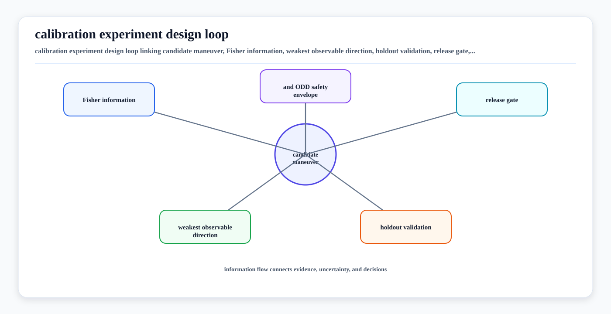

# Active Calibration Experiment Design

<!-- kb-visual:start -->


*Visual: calibration experiment design loop linking candidate maneuver, Fisher information, weakest observable direction, holdout validation, release gate, and ODD safety envelope.*
<!-- kb-visual:end -->

Calibration quality is not only a solver property. It is also a data-collection
property: the vehicle, robot, bay, route, targets, and operating conditions must
make the calibration parameters observable before the estimate can be trusted.

This page covers active and optimal experiment design for autonomy calibration.
It complements [Multi-Sensor Calibration Observability](multi-sensor-calibration-observability.md),
[Sensor Calibration and Time Synchronization](sensor-calibration-time-synchronization.md),
[Calibration Bay Fixtures](../../20-av-platform/sensors/calibration-bay-fixtures.md), and
[Sensor Calibration Fleet Operations](../../40-runtime-systems/software-operations/sensor-calibration-fleet-ops.md).

## Scope

Active calibration experiment design answers one question:

> What data should the system collect so the calibration state becomes
> identifiable, accurate, and safe to release?

It applies before and during:

- factory calibration
- maintenance-bay calibration
- route-based validation
- targetless field monitoring
- active online calibration runs
- fault-injection and release benchmarking

It does not mean silently rewriting safety-relevant transforms during normal
operation. For production AVs, online or active calibration should usually
produce evidence, confidence, and maintenance actions before it produces an
automatically accepted calibration package.

## Inputs and Outputs

| Item | Examples |
|---|---|
| Candidate calibration states | camera intrinsics, LiDAR-camera extrinsics, LiDAR-IMU extrinsics, radar yaw/height, GNSS lever arm, time offsets |
| Available excitation | turns, accelerations, stops, figure-eights, slopes, target passes, bay turntable motion, route segments |
| Measurement models | reprojection residuals, ICP overlap residuals, radar-track residuals, IMU preintegration residuals, fiducial pose residuals |
| Constraints | speed limits, safe maneuver envelope, bay size, ODD rules, human proximity, surface friction, fixture visibility |
| Quality metrics | Fisher information, Hessian rank, covariance, condition number, holdout residuals, downstream replay deltas |

Outputs should be reviewable artifacts:

- a planned calibration maneuver or route segment
- required target or scene geometry
- expected observable degrees of freedom
- minimum data duration and coverage
- residual and covariance acceptance criteria
- holdout validation plan
- safety envelope for active collection
- reason for inconclusive calibration when excitation is insufficient

## Core Idea

Most calibration solvers minimize residuals:

```
min_x sum_i || r_i(x) ||^2
```

Experiment design asks whether the collected residuals actually identify the
state `x`.

Linearized around the current estimate:

```
r(x + dx) ~= r(x) + J dx
H = J^T W J
```

The Hessian or Fisher information matrix tells how much the measurements
constrain each direction in parameter space. If `H` is rank-deficient or poorly
conditioned, the optimizer may still return a value, but one or more calibration
directions are weakly identified.

Useful design metrics include:

| Metric | Meaning | Calibration interpretation |
|---|---|---|
| Rank | number of identifiable parameter directions | catches unobservable states |
| Minimum eigenvalue | weakest constrained direction | E-optimal style guard against hidden weak modes |
| Determinant | volume reduction of uncertainty ellipsoid | D-optimal style information gain |
| Trace of covariance | total expected uncertainty | A-optimal style average variance reduction |
| Condition number | strongest vs weakest direction ratio | catches fragile estimates |
| Holdout residual | validation on data not used for fitting | catches overfit to a target, route, or scene |

The metric should match the release risk. For aircraft clearance, docking,
forklift pallet handling, or safety-scanner fields, a single weak direction can
matter more than average error, so minimum-eigenvalue and worst-case covariance
checks are often more useful than a global residual alone.

## Design Loop

1. Define the calibration state and transform direction.
2. List the consumers of that state: fusion, SLAM, occupancy, map alignment,
   planner clearance, incident replay, or safety monitor.
3. Choose candidate data-collection actions within the safe operating envelope.
4. Predict or measure the information each action adds.
5. Select actions that improve the weakest observable direction, not only the
   average residual.
6. Collect data with timestamps, vehicle state, target layout, route context,
   and environmental conditions.
7. Fit the calibration on one subset and validate on holdout scenes or route
   segments.
8. Publish pass, restricted pass, inconclusive, or block.

The loop is useful even when the final calibration method is manual or
target-based. A bay checklist that requires target visibility, multiple depths,
and route holdout validation is already a form of experiment design.

## Sensor-Pair Patterns

| Pair | Good excitation | Weak or degenerate data | Design note |
|---|---|---|---|
| Camera intrinsics | target across image regions, depths, focus states, and temperature range | centered target at one distance | include edge/corner coverage and lens/housing thermal states |
| LiDAR-camera extrinsics | shared high-contrast edges, fiducials or textured 3D structure, varied range and yaw | flat wall, sparse overlap, repeated same target pose | split residuals by image region, depth, and target/targetless holdout |
| LiDAR-LiDAR extrinsics | overlapping 3D structure across height and range, turns, static scenes | flat floor or only parallel walls | check local geometry eigenvalues before trusting ICP residuals |
| LiDAR-IMU extrinsics | turns, acceleration, slopes, and non-degenerate 3D scenes | straight constant-speed driving | separate spatial error from time offset and deskew error |
| Radar-camera or radar-LiDAR | static reflectors, moving objects with reliable tracks, varied azimuth and range | multipath-heavy scene or only one range/angle | record radar mounting model, Doppler sign, and association confidence |
| GNSS antenna lever arm | turns with high-quality fixes and known vehicle frame | straight route only | validate against map or surveyed control, not just filter convergence |
| Time offsets | changing angular and linear velocity with hardware timestamp provenance | stationary or constant velocity | measure offset sensitivity as a function of speed and yaw rate |
| Thermal-visible alignment | heated visible targets, stable thermal contrast, NUC event logging | low contrast or reflective metal target | include emissivity, reflected temperature, and camera warm-up state |

## Active Online Calibration

Active online calibration plans or selects data while the system is running.
Recent research examples include:

- observability-aware active calibration that uses a Fisher information matrix,
  a minimum-eigenvalue objective, B-spline trajectory generation, and online
  replanning for ground robot extrinsics
- targetless online LiDAR-camera calibration that selects scene content or
  feature density before optimizing cross-modal correspondences
- iterative LiDAR-camera refinement pipelines that update alignment from
  matched object-level or structural features

These are useful research directions, but a production vehicle should separate
three concepts:

| Concept | Production treatment |
|---|---|
| Online validation | safe and desirable; reports whether the current calibration still looks valid |
| Online estimation | useful for diagnosis and maintenance evidence; needs degeneracy checks and holdout validation |
| Online auto-correction | safety-critical; should require bounded updates, rollback, provenance, and a separate safety case |

For normal autonomous operation, active calibration maneuvers must stay inside
the approved ODD and should not surprise nearby workers, vehicles, aircraft,
forklifts, or pedestrians. In many fleets, active collection is best scheduled
as a depot, commissioning, or low-risk route-validation task rather than as a
background behavior mixed with revenue service.

## Domain Fit

| Domain | Fit | Notes |
|---|---|---|
| Road AV | high | route-based validation can include turns, slopes, speed changes, and diverse scene geometry; safety case must prevent unsafe calibration maneuvers |
| Airport airside | high | low speeds help timing validation, but active maneuvers must respect stand, aircraft, jet-blast, and personnel rules |
| Indoor AMR and warehouse | high | fiducials, racks, dock geometry, and controlled cells make repeatable experiments practical |
| Logistics yard and port | high | trailer/container geometry and rough outdoor surfaces make route holdout and vibration coverage important |
| Mining and construction | medium-high | broad open spaces can be degenerate for some pairs; slopes, vibration, dust, and large vehicle frames need explicit coverage |
| Agriculture | medium | seasonal scenes and low-feature fields can weaken visual/LiDAR calibration, so route/target planning matters |
| Delivery robot and campus | medium-high | sidewalks and curbs give structure, but active maneuvers must be socially and operationally acceptable |

Airside should not be the default lens for this page. The common principle is
observability under safe excitation. Airside simply makes the operational
approval and evidence trail more visible because vehicles operate around
aircraft, crew, stands, and regulated procedures.

## Failure Modes

| Failure mode | Symptom | Control |
|---|---|---|
| Residual-only acceptance | low training residual but large field error | require rank/covariance and holdout checks |
| One-axis motion | translation, roll, pitch, or lever arm stays weak | add multi-axis turns, slopes, or target viewpoints |
| Target overfit | calibration passes in bay but fails on route | validate with route data and independent fixtures |
| Scene degeneracy | ICP or targetless residual reports false confidence | check geometry eigenvalues and feature diversity |
| Dynamic-object dominance | online monitor chases traffic or workers | use static-scene filters and prerequisite states |
| Time-space confounding | spatial extrinsics absorb timestamp error | estimate or validate time offsets separately |
| Unsafe active maneuver | calibration collection conflicts with operations | constrain trajectory optimization by ODD, speed, and exclusion zones |
| Silent auto-correction | online update changes behavior without review | separate monitor, estimate, release, and activation steps |
| Missing provenance | good calibration cannot be audited later | store route, target layout, tool version, raw logs, and package IDs |

## Implementation Notes

- Treat experiment design as part of the calibration artifact, not a notebook
  side effect.
- Store the intended observable degrees of freedom and the actual achieved
  coverage in the validation report.
- Report inconclusive when the data lacks excitation. A false green calibration
  is worse than a blocked release.
- Use holdout route slices that include the downstream risk: near-field
  clearance, long-range projection, wet/glare surfaces, vibration, or low-light
  conditions.
- Keep online estimates bounded and traceable. Do not write directly into the
  active transform tree unless the runtime and safety case are built for that.
- Link active calibration runs to fleet maintenance tickets when drift suggests
  a physical mount, lens, bracket, or clock problem.

## Related Repository Docs

- [Multi-Sensor Calibration Observability](multi-sensor-calibration-observability.md)
- [Sensor Calibration and Time Synchronization](sensor-calibration-time-synchronization.md)
- [Camera Imaging, Noise, and Calibration](camera-imaging-noise-calibration.md)
- [Point Cloud Registration Math: ICP, NDT, and GICP](point-cloud-registration-math-icp-ndt-gicp.md)
- [Eigenvalues, Hessian Conditioning, and Observability](../numerical-linear-algebra/eigenvalues-hessian-conditioning-observability.md)
- [Calibration Bay Fixtures](../../20-av-platform/sensors/calibration-bay-fixtures.md)
- [Sensor Calibration Fleet Operations](../../40-runtime-systems/software-operations/sensor-calibration-fleet-ops.md)
- [Multi-Sensor Calibration Release Benchmark](../../60-safety-validation/verification-validation/multi-sensor-calibration-release-benchmark.md)

## Sources

- Wang et al., "Observability-Aware Active Calibration of Multi-Sensor Extrinsics for Ground Robots via Online Trajectory Optimization," arXiv 2025: https://arxiv.org/abs/2506.13420
- AISLAB SUSTech, "Multisensor-Calibration" code and data: https://github.com/AISLAB-sustech/Multisensor-Calibration
- Das, Touma, and Burdick, "Bayesian Optimal Experimental Design for Robot Kinematic Calibration," ICRA 2025: https://arxiv.org/abs/2409.10802
- Huang et al., "Environment-Driven Online LiDAR-Camera Extrinsic Calibration," TASE 2025: https://arxiv.org/abs/2502.00801
- MIAS project page for EdO-LCEC: https://mias.group/EdO-LCEC/
- Cheng et al., "CalibRefine: Deep Learning-Based Online Automatic Targetless LiDAR-Camera Calibration with Iterative and Attention-Driven Post-Refinement," arXiv 2025: https://arxiv.org/abs/2502.17648
- Radar-Lab CalibRefine repository: https://github.com/radar-lab/Lidar_Camera_Automatic_Calibration
- Autoware calibration status classifier: https://autowarefoundation.github.io/autoware_universe/main/sensing/autoware_calibration_status_classifier/
- Autoware LiDAR-camera calibration tutorial: https://autowarefoundation.github.io/autoware-documentation/main/tutorials/integrating-autoware/creating-vehicle-and-sensor-model/calibrating-sensors/lidar-camera-calibration/
- Kalibr camera-IMU calibration toolbox: https://github.com/ethz-asl/kalibr
