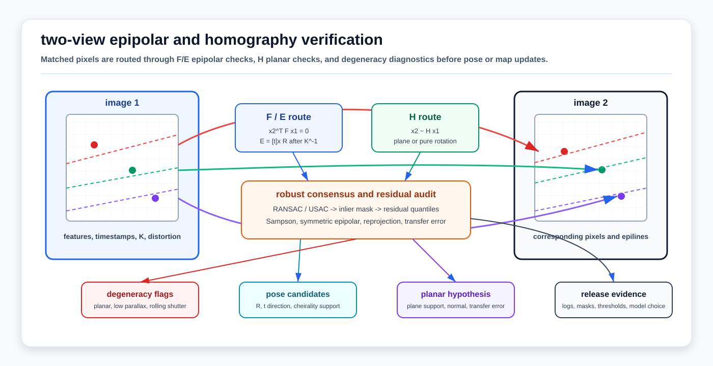

# Epipolar Geometry, Homographies, and Two-View Verification

<!-- kb-visual:start -->


*Visual: two-view verification diagram showing matched pixels, epipolar lines, fundamental and essential matrix routing, plane-induced homography, inlier masks, and degeneracy diagnostics.*
<!-- kb-visual:end -->

Cameras convert 3D structure into 2D rays. Epipolar geometry and homographies are the first tests that decide whether two images agree about the same scene before a stack trusts visual odometry, stereo validation, loop closure, camera calibration QA, or map-image alignment.

This page is the two-view model-selection layer that sits next to [Camera Projective Geometry, PnP, and Triangulation](camera-projective-geometry-pnp-triangulation.md). PnP uses 3D-to-2D correspondences and triangulation estimates 3D points from known poses; two-view epipolar and homography models instead start with 2D-to-2D matches and ask which camera-motion or planar-scene hypothesis is defensible.

---

## 1. Related Docs

- [Camera Projective Geometry, PnP, and Triangulation](camera-projective-geometry-pnp-triangulation.md)
- [Optical Flow and Scene Flow First Principles](optical-flow-scene-flow-first-principles.md)
- [Camera Imaging, Noise, and Calibration](camera-imaging-noise-calibration.md)
- [Coordinate Frames, Projections, and SE(3)](coordinate-frames-projections-se3.md)
- [Correspondence Search and Data Structures](correspondence-search-data-structures.md)
- [Sensor Calibration and Time Synchronization](sensor-calibration-time-synchronization.md)
- [Robust Statistics, RANSAC, and Hypothesis Testing](../probability-statistics/robust-statistics-ransac-hypothesis-testing.md)
- [Objective, Residual Design, and Audit](../optimization/objective-residual-design-and-audit.md)
- [Loop Closure and Place Recognition First Principles](../state-estimation/loop-closure-place-recognition-first-principles.md)
- [Bundle Adjustment SLAM](../../30-autonomy-stack/localization-mapping/slam-methods/bundle-adjustment-slam.md)

---

## 2. Why It Matters for AV, Perception, SLAM, and Mapping

| Workflow | Two-view role | AV risk if wrong |
|---|---|---|
| Visual odometry initialization | Estimate relative rotation/translation direction from matched image points. | A low-parallax or planar pair can produce plausible but wrong scale, direction, or pose candidates. |
| Stereo validation | Check whether matches lie on the expected epipolar lines before triangulation. | False stereo matches create depth spikes that contaminate obstacles, maps, or calibration labels. |
| Loop closure verification | Reject appearance-only matches that fail geometric consistency. | A false loop can bend a map or localize the vehicle to a visually similar but wrong area. |
| Camera calibration QA | Use residual patterns to detect bad intrinsics, distortion, rolling-shutter timing, or extrinsics. | Calibration drift looks like perception noise until projected boxes and features are systematically shifted. |
| Map-image alignment | Use homographies for planar signs, ground patches, dock markings, or calibration boards. | A homography fitted outside planar assumptions can make a non-flat scene appear aligned. |
| Learned geometry sanity checks | Compare neural correspondence, depth, or pointmap outputs against classic two-view constraints. | A learned model may be confident on texture or domain shift where rigid geometry says the match set is inconsistent. |

---

## 3. Inputs, Outputs, and Model Choice

### 3.1 Inputs

| Input | Contract |
|---|---|
| Matched pixels | Pairs `x1_i <-> x2_i` with match scores, descriptor/source IDs, and image pyramid scale. |
| Camera intrinsics | `K1`, `K2`, distortion model, image size, and whether pixels have already been undistorted. |
| Timing | Exposure midpoint, frame timestamps, rolling-shutter model, and vehicle motion context if available. |
| Match provenance | Feature matcher, learned correspondence model, optical flow, fiducial detector, or semantic landmark source. |
| Prior constraints | Stereo rig baseline, expected vehicle motion, IMU yaw/roll/pitch prior, planar target metadata, or map plane. |

### 3.2 Outputs

| Output | Meaning |
|---|---|
| `F` | Fundamental matrix that maps a pixel in one image to an epipolar line in the other image. |
| `E` | Essential matrix for calibrated normalized coordinates, containing relative rotation and translation direction constraints. |
| `H` | Homography that maps points between views when the scene is planar or the camera motion is pure rotation. |
| Inlier mask | The subset of matches that satisfy the selected residual and threshold. |
| Relative-pose candidates | Candidate `(R, t direction)` solutions from `E`, filtered by cheirality and priors. |
| Plane hypothesis | Candidate plane normal and translation relation from `H`, if decomposition is used. |
| Diagnostics | Inlier ratio, residual distribution, parallax, spatial support, model competition, and degeneracy flags. |

### 3.3 Model Choice

| Model | Minimal data | Best fit | Caveat |
|---|---|---|---|
| Fundamental matrix `F` | 7 or 8 uncalibrated point pairs. | Pixel-space epipolar verification when intrinsics are unknown or not trusted. | Does not directly give metric relative pose without calibration. |
| Essential matrix `E` | 5 or more calibrated normalized point pairs. | Relative pose for calibrated camera pairs and visual odometry. | Translation scale is unobservable from two monocular views. |
| Homography `H` | 4 point pairs. | Planar targets, road/ground patches, signs, image stabilization, pure rotation, and map-image alignment. | Can win incorrectly in mostly planar or low-parallax scenes. |
| PnP | 3D-to-2D correspondences. | Pose against a known map, marker, board, or landmark set. | Different problem: it requires 3D anchors rather than only two image views. |
| Triangulation | Two or more views with known poses. | Landmark depth after the pose/model has been accepted. | Depth is unstable under small baseline or bad correspondence geometry. |

---

## 4. Core Geometry

### 4.1 Epipolar Constraint

For a 3D point observed as homogeneous pixels `x1` and `x2`, the fundamental matrix enforces:

```text
x2^T F x1 = 0
l2 = F x1
l1 = F^T x2
```

`l2` is the epipolar line in image 2 corresponding to point `x1`; `l1` is the corresponding line in image 1. The geometric test is not whether the two pixels are close in image coordinates, but whether each pixel is close to the line predicted by the other view.

### 4.2 Essential Matrix

With calibrated normalized image points:

```text
x_norm = K^-1 x
x2_norm^T E x1_norm = 0
E = [t]_x R
```

The essential matrix constrains the relative rotation `R` and translation direction `t` between cameras. Decomposition produces multiple pose candidates; the physically valid candidate must put triangulated points in front of both cameras.

Two-view monocular geometry does not recover absolute translation scale. Scale must come from stereo baseline, IMU/wheel/GNSS integration, known object size, map priors, or later bundle adjustment with metric constraints.

### 4.3 Fundamental Matrix

When intrinsics are known:

```text
F = K2^-T E K1^-1
```

The fundamental matrix is useful for pixel-space verification, legacy cameras, or cases where the geometric check should happen before normalized camera coordinates are trusted. It also exposes calibration problems: a strong `F` fit with poor `E` fit can indicate bad intrinsics, distortion handling, or inconsistent camera metadata.

### 4.4 Homography

A homography maps points on a common plane between views:

```text
x2 ~ H x1
H ~ K2 (R - t n^T / d) K1^-1
```

where `n` is the plane normal and `d` is its distance in camera-1 coordinates. For pure rotation, the plane term drops out and:

```text
H ~ K2 R K1^-1
```

This is why homographies are valid for calibration boards, planar signs, floor/road patches under local flatness assumptions, image stitching, and camera rotation. They are not a general 3D scene model.

### 4.5 Residuals and Robust Estimation

Common residual choices:

| Residual | Typical use | Notes |
|---|---|---|
| Point-to-epipolar-line distance | Fast `F` or `E` scoring. | Needs normalization so thresholds map to pixel noise. |
| Sampson distance | Fundamental-matrix scoring. | First-order approximation to geometric reprojection error. |
| Symmetric epipolar distance | `F`/`E` verification. | Scores both image directions. |
| Reprojection distance | Homography, PnP, and triangulation refinement. | Easier to map to pixel thresholds but model-specific. |
| Symmetric homography transfer error | Planar image-to-image checks. | Evaluates forward and inverse mapping consistency. |

Use RANSAC, USAC, LMedS, MAGSAC-style variants, or a documented robust estimator because feature matching and learned correspondence proposals often contain many outliers. The robust threshold is a release parameter, not a magic constant: it should be tied to keypoint precision, undistortion quality, image scale, rolling-shutter motion, and downstream risk.

---

## 5. Algorithm Steps

### 5.1 Two-View Geometric Verification

1. Gather candidate matches with pixel coordinates, image IDs, timestamps, scale, and match confidence.
2. Undistort or normalize points exactly once; record whether thresholds are in pixels or normalized units.
3. Fit `F`, `E`, and/or `H` inside a robust estimator with deterministic seed policy for regression tests.
4. Compare model support: inlier count, residual quantiles, spatial coverage, parallax, and whether inliers collapse to a plane or repeated texture region.
5. Decompose `E` only after the calibrated model is credible; apply cheirality and vehicle-motion priors.
6. Decompose or use `H` only when planar or pure-rotation assumptions are expected and documented.
7. Refine accepted models with all inliers and report residual distributions, not only the final matrix.
8. Hand accepted constraints to PnP, triangulation, bundle adjustment, loop closure, or calibration QA with provenance and failure flags preserved.

### 5.2 Relative-Pose Initialization

1. Start with calibrated image points.
2. Estimate `E` robustly using a five-point or nonminimal solver.
3. Recover pose candidates and triangulate a small inlier subset.
4. Select the pose with maximum positive-depth support and plausible vehicle motion.
5. Reject the pair if parallax is too low, inliers are spatially clustered, or the homography score is equally strong in a planar scene.
6. Pass the result to bundle adjustment or a visual-inertial estimator as an initialization, not as final ground truth.

### 5.3 Homography Verification

1. Fit `H` from four or more point pairs under RANSAC/USAC.
2. Score forward and inverse reprojection error in pixels.
3. Check whether the inlier set lies on a known plane, marker, sign, floor, dock line, or local ground patch.
4. Reject `H` for general 3D scene alignment unless the application explicitly expects pure rotation or a planar approximation.
5. If decomposed, validate candidate rotations, translations, and plane normals against calibration, IMU, map, or target metadata.

---

## 6. Assumptions and Domain Fit

| Domain | Good fit | Transfer caveats |
|---|---|---|
| Road AVs and robotaxis | Stereo validation, visual odometry, lane/sign/map alignment, loop closure, and learned-depth checks. | Dynamic traffic, rolling shutter, glare, rain, and long forward-motion segments create low-parallax or outlier-heavy pairs. |
| Airside autonomy | Apron marking alignment, dock/stand fiducials, calibration boards, visual QA around aircraft/GSE, and loop-closure rejection. | Texture-poor pavement, wide open spaces, de-icing mist, jet blast shimmer, and repeated markings can make homography support misleading. |
| Warehouses and logistics yards | Fiducials, rack/door plane alignment, trailer-dock markings, and low-speed stereo checks. | Repeated shelf or container patterns need semantic and spatial support checks, not only inlier count. |
| Ports, mines, construction, agriculture | Visual-inertial initialization, machine-marker alignment, surveyed target checks, and map-image QA. | Dust, mud, vegetation, vibration, and temporary layouts increase outliers and violate static-scene assumptions. |
| Delivery robots and outdoor campuses | Low-cost camera odometry, curb/ground-plane checks, visual loop verification, and crosswalk/sign alignment. | Pedestrians, close objects, low camera height, fisheye lenses, and rolling shutter require careful distortion and timing treatment. |

---

## 7. Failure Modes and Diagnostics

| Symptom | Likely cause | Diagnostic |
|---|---|---|
| Many inliers but wrong relative pose. | Planar scene, repeated texture, or low parallax lets a bad model dominate. | Compare `E` versus `H` support, plot inlier spatial coverage, and check triangulation angles. |
| Essential-matrix pose flips or jumps. | Cheirality ambiguity, near-pure rotation, or noisy correspondences. | Count positive-depth points for each candidate and gate against IMU/vehicle-motion priors. |
| Fundamental matrix fits but essential matrix does not. | Bad intrinsics, distortion mismatch, resized images with stale `K`, or mixed camera metadata. | Re-run with undistorted normalized points and audit calibration provenance. |
| Homography works on a road patch but fails on obstacles. | The scene is not planar even if the ground is locally flat. | Visualize residuals by semantic class and reject off-plane points before using `H`. |
| Epipolar residual grows by image row. | Rolling shutter, exposure timing, or ego-motion interpolation error. | Plot residual versus row and angular velocity; compare global-shutter or deskewed samples. |
| Inliers cluster in one corner. | Feature matcher found one textured patch, not scene-wide support. | Require spatial bins, semantic diversity, or minimum baseline support. |
| RANSAC is flaky across runs. | Random seed, parallel robust-estimation policy, or unstable match ordering. | Fix deterministic seeds for regression tests and sort matches by stable keys. |
| Visual loop closure passes on similar places. | Appearance descriptors found a repeated structure and geometry did not have enough parallax. | Require multi-hypothesis scoring, map priors, temporal consistency, or independent sensor confirmation. |

---

## 8. Implementation Notes

- Keep point units explicit. `findFundamentalMat` thresholds are usually in pixels; essential-matrix thresholds can be pixels or normalized units depending on API overload and camera-matrix handling.
- Do not estimate ideal pinhole two-view geometry on raw distorted pixels unless the API explicitly handles the distortion model.
- Normalize coordinates for numerical conditioning, especially for eight-point fundamental-matrix estimation.
- Prefer calibrated `E` for relative-pose initialization when intrinsics are reliable; prefer `F` for pixel-space verification or calibration debugging.
- Treat `H` as a planar or pure-rotation model. A high homography inlier count in road, apron, or warehouse imagery is a degeneracy warning for general 3D motion.
- Report more than one scalar: inlier count, inlier ratio, residual quantiles, parallax/triangulation angle, model competition, and spatial support are all needed for release review.
- Use held-out matches or later bundle-adjustment residuals to detect overfitting a robust estimator to repeated texture.
- Preserve match provenance and inlier masks in logs. Debugging a false loop or calibration drift requires knowing which features created the accepted model.
- For learned feature or correspondence systems, keep a classic geometric verification stage unless the learned model is explicitly trained and validated to replace it under the target ODD.

---

## 9. AV Release Evidence

Two-view geometry should appear in release evidence as a diagnostic gate, not only as math inside a visual front end:

- Calibration release: residual maps before and after intrinsics/extrinsics updates, with `F`/`E`/`H` consistency checks on held-out scenes.
- Visual-odometry release: failed-pair taxonomy for low parallax, planar scenes, rolling shutter, repeated texture, and dynamic objects.
- Loop-closure release: appearance-only candidates rejected by geometric verification, plus accepted candidates reviewed by residual and map-impact tests.
- Dataset release: flags for sequences where public-road, warehouse, yard, port, mine, farm, campus, or airside imagery violates assumptions through weather, texture, rolling shutter, or dynamic-scene dominance.
- Runtime monitoring: counters for inlier ratio, residual quantiles, model selection, cheirality failure, parallax, and deterministic robust-estimator status.

---

## 10. Sources

- OpenCV, "Camera Calibration and 3D Reconstruction", calib3d module documentation: https://docs.opencv.org/4.x/d9/d0c/group__calib3d.html
- OpenCV, "Epipolar Geometry": https://docs.opencv.org/4.x/da/de9/tutorial_py_epipolar_geometry.html
- OpenCV, "Basic concepts of the homography explained with code": https://docs.opencv.org/4.x/d9/dab/tutorial_homography.html
- OpenCV, "USAC: Improvement of Random Sample Consensus in OpenCV": https://docs.opencv.org/4.x/de/d3e/tutorial_usac.html
- Richard Hartley and Andrew Zisserman, "Multiple View Geometry in Computer Vision", second edition, Oxford VGG page: https://www.robots.ox.ac.uk/~vgg/hzbook/
- Richard Hartley and Andrew Zisserman, "Multiple View Geometry in Computer Vision", Cambridge University Press listing: https://www.cambridge.org/core/books/multiple-view-geometry-in-computer-vision/0B6F289C78B2B23F596CAA76D3D43F7A
- David Nister, "An Efficient Solution to the Five-Point Relative Pose Problem", IEEE TPAMI 2004 DOI record: https://doi.org/10.1109/TPAMI.2004.17
- Richard I. Hartley, "In Defense of the Eight-Point Algorithm", IEEE TPAMI 1997 DOI record: https://doi.org/10.1109/34.601246
