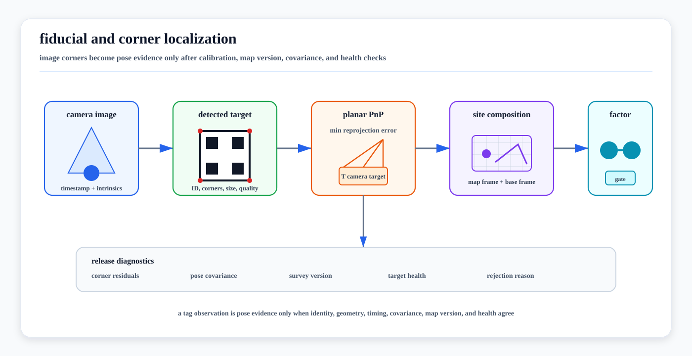

# Fiducial and Corner Localization

<!-- kb-visual:start -->


*Visual: fiducial and corner localization chain from image evidence through marker decoding, planar PnP, map-frame composition, estimator factors, and release diagnostics.*
<!-- kb-visual:end -->

Fiducial and corner localization uses deliberately placed visual targets to turn
image measurements into pose evidence. A camera detects a marker or board,
extracts corners, associates them with known target geometry, solves a
3D-to-2D pose problem, and hands the result to localization, SLAM, calibration,
or docking logic with uncertainty and health metadata.

This page is the runtime measurement-model companion to [Camera Projective
Geometry, PnP, and Triangulation](camera-projective-geometry-pnp-triangulation.md),
[Epipolar Geometry, Homographies, and Two-View Verification](epipolar-geometry-homographies-two-view.md),
[Sensor Calibration and Time Synchronization](sensor-calibration-time-synchronization.md),
[Active Calibration Experiment Design](active-calibration-experiment-design.md),
[Infrastructure-Aided Localization](../../30-autonomy-stack/localization-mapping/overview/infrastructure-aided-localization.md),
and [Calibration Bay Fixtures](../../20-av-platform/sensors/calibration-bay-fixtures.md).

---

## 1. Scope

This page covers visual fiducials and calibrated corner targets used as pose
evidence:

- AprilTag and AprilGrid targets
- ArUco and ChArUco markers and boards
- checkerboards and chessboard corners
- surveyed marker maps in managed sites
- planar PnP and IPPE-style square-marker pose estimation
- factor-graph handoff for localization, loop closure, docking, and calibration

It does not replace general feature-based visual SLAM. Tags and boards are
useful because they encode identity, scale, and geometry, but that usefulness
depends on target installation, survey quality, camera calibration, and runtime
health checks.

---

## 2. Inputs and Outputs

| Item | Contract |
|---|---|
| Image evidence | Image timestamp, exposure state, camera ID, image frame, lens/rolling-shutter model, and preprocessing history. |
| Camera calibration | Intrinsics, distortion model, image size, camera-to-base extrinsic, and calibration package ID. |
| Target definition | Marker family or dictionary, tag ID, tag size, board layout, corner order, target coordinate frame, and printable revision. |
| Target survey | `T_site_target`, survey covariance, map tile/version, inspection date, and health state. |
| Detection output | Corner pixels, decoded IDs, corner order, decision margin or confidence, rejected candidates, and reprojection residuals. |
| Pose output | `T_camera_target`, optional `T_site_base`, covariance or quality class, ambiguity flag, timestamp, and rejection reason. |

The consuming estimator should know whether a measurement is a precise pose
factor, a weak pose prior, a bearing/landmark factor, an identity cue, or only a
diagnostic observation.

---

## 3. Measurement Chain

### 3.1 Detect and Identify

A square fiducial provides corner correspondences and an encoded identity. ArUco
documentation describes binary square markers where the four corners are enough
to obtain camera pose, while the internal binary code supports ID checks and
error detection. AprilTag adds robust tag families and detector tooling that are
widely used in robotics. ChArUco boards combine marker IDs with chessboard-like
corner refinement so partially observed boards can still produce ordered corner
measurements.

The detector should output more than a pose:

- detected tag or board ID
- image-space corner coordinates and ordering
- corner quality or subpixel refinement status
- decode margin, Hamming/error-correction result, or marker confidence
- rejected candidate count and reason when available
- image timestamp and camera frame

### 3.2 Build 3D-to-2D Correspondences

For a square marker with side length `s`, the marker-frame points are usually the
four target corners:

```text
P0 = [-s/2,  s/2, 0]
P1 = [ s/2,  s/2, 0]
P2 = [ s/2, -s/2, 0]
P3 = [-s/2, -s/2, 0]
```

For a ChArUco or AprilGrid target, each detected corner has a board-frame point
from the target definition. The target definition is therefore a safety-relevant
artifact: wrong tag size, wrong spacing, wrong corner order, or a mismatched
print revision creates a systematic pose error that can look like camera noise.

### 3.3 Solve the Pose

The pose estimate minimizes reprojection residuals:

```text
z_i ~= project(K, distortion, T_camera_target * P_i)
r_i = z_i - project(...)
```

For square planar markers, OpenCV exposes `SOLVEPNP_IPPE_SQUARE` as a marker
pose-estimation option. IPPE-style solvers are useful because planar pose can
have ambiguous solutions, especially when a tag is nearly fronto-parallel,
small, far away, or observed with few pixels. Production systems should keep
ambiguity and residual diagnostics instead of accepting only the lowest-cost
pose.

### 3.4 Compose Into the Vehicle and Site Frames

A marker pose becomes localization evidence only after the transform chain is
explicit. With the convention `T_a_b` maps coordinates from frame `b` into
frame `a`, one common chain is:

```text
T_site_base =
  T_site_target *
  inverse(T_camera_target) *
  inverse(T_base_camera)
```

Here `T_camera_target` is the PnP output, `T_base_camera` is the calibrated
camera extrinsic, and `T_site_target` is the surveyed target pose. The exact
notation can differ by library, and some APIs return the inverse transform. The
release artifact should state the frame convention and transform direction so a
tag observation is not silently inverted.

### 3.5 Hand Off to Estimation

Common handoff patterns:

| Pattern | Use | Review question |
|---|---|---|
| Pose prior | Startup, bay entry, charger approach, docking reset candidate | Is it covariance-bounded and compatible with current map version? |
| Landmark factor | SLAM or localization graph with known target pose | Are ID, survey covariance, corner residuals, and camera calibration included? |
| Loop-closure factor | Visual relocalization or TagSLAM-style graph constraint | Was the association verified against geometry and zone policy? |
| Calibration check | Compare expected and observed target pose | Does residual drift trigger maintenance rather than silent calibration rewrite? |
| Identity cue | Select dock, stand, shelf, charger, fixture, or map tile | Is semantic identity separated from metric pose confidence? |

---

## 4. Failure Modes

| Failure mode | How it appears | Mitigation |
|---|---|---|
| Planar ambiguity | Two plausible poses from a nearly fronto-parallel or low-pixel marker | Use IPPE/generic multi-solution checks, distance limits, multi-marker boards, and estimator priors. |
| Wrong tag size or board layout | Consistent but biased translation or scale | Version target definitions and print manifests with the map/calibration package. |
| Reused or ambiguous IDs | Vehicle localizes to the wrong dock or aisle | Use site-unique ID namespaces, zone gating, and map-version compatibility checks. |
| Corner blur or rolling shutter | High residual, yaw bias, pose jitter | Gate by corner quality, exposure/motion state, and rolling-shutter timing evidence. |
| Bad intrinsics or distortion | Residuals vary by image region and range | Revalidate camera calibration and use holdout views at multiple depths. |
| Marker damage or contamination | Intermittent detection, wrong decode, biased corner fit | Inspect targets, log rejected candidates, and remove unhealthy targets from active manifests. |
| Survey drift | A moved marker remains visually detectable but map-inconsistent | Treat target pose as a versioned surveyed asset with covariance, inspection, and rollback. |
| Map-version mismatch | Tag observation is fused against the wrong site frame | Bind marker manifests to map tiles and reject incompatible versions. |
| Overconfident single-tag update | Estimator jumps from one visually clean but wrong observation | Use robust factors, covariance inflation, multi-sensor agreement, and no-hard-reset policy. |

---

## 5. Domain Fit

| Domain | Fit | Notes |
|---|---|---|
| Warehouses and indoor AMRs | Strong | Tags, ChArUco boards, shelf markers, dock markers, and charger targets are easy to survey and maintain. |
| Loading docks and logistics yards | Strong in controlled zones | Door markers and dock boards help final approach, but weather, truck occlusion, and dirt require health checks. |
| Airport aprons and hangars | Strong for managed bays, weak as global truth | Hangars, calibration bays, stands, chargers, and docking funnels can use surveyed tags; open aprons still need LiDAR/GNSS/map fallback. |
| Ports and mines | Moderate | Markers work around workshops, chargers, portals, and controlled entrances, but dust, vibration, and large equipment increase maintenance burden. |
| Outdoor campuses | Moderate | Useful for building entrances, robots docks, gates, and service corridors; less reliable under glare, vandalism, and weather. |
| Public-road AVs | Limited | Roadside marker ownership and coverage are inconsistent; treat tags as local aids or work-zone fixtures, not the default localization backbone. |

---

## 6. Implementation Notes

1. Keep tag maps in the same artifact system as map tiles, calibration packages,
   and route releases.
2. Store target size, spacing, layout, dictionary/family, printable revision,
   and physical installation record.
3. Log accepted and rejected detections, not only fused poses.
4. Publish covariance or quality classes that distinguish high-resolution
   board observations from distant single-tag observations.
5. Reject observations with unknown camera calibration, unknown map version,
   stale timestamp, unhealthy target, or repeated ID outside the expected zone.
6. Use multi-marker boards or multiple viewing poses when the update can change
   a safety-relevant vehicle pose.
7. Treat automatic calibration updates as proposals unless a release workflow
   has explicitly approved online calibration changes.
8. Test failure cases: partially occluded tags, dirty tags, wrong tag size,
   duplicate IDs, rolling shutter, low light, motion blur, and map rollback.

---

## 7. Release Evidence

A reviewable release package should include:

- camera calibration package and timestamp policy
- target manifest with surveyed poses and covariance
- marker dictionary/family and board definition files
- transform-direction convention for each output pose
- replay logs with accepted, rejected, and ambiguous detections
- residual and corner-quality distributions by target, range, and image region
- estimator innovation/NIS or factor residual checks after fusion
- maintenance state for each physical target
- rollback behavior when a target or map tile is retired

---

## 8. Boundaries With Adjacent Pages

- Use [Camera Projective Geometry, PnP, and Triangulation](camera-projective-geometry-pnp-triangulation.md) for the underlying projection and PnP math.
- Use [Infrastructure-Aided Localization](../../30-autonomy-stack/localization-mapping/overview/infrastructure-aided-localization.md) for the wider managed-site aid contract across UWB, visual targets, RF identity, magnetic maps, reflectors, and 5G positioning.
- Use [Factor Graph SLAM with iSAM2 and GTSAM](../../30-autonomy-stack/localization-mapping/slam-methods/factor-graph-isam2-gtsam.md) for estimator graph construction and incremental smoothing.
- Use [Autonomous Docking and Precision Positioning](../../30-autonomy-stack/planning/autonomous-docking-precision-positioning.md) when marker pose is consumed by final-approach planning and control.
- Use [Calibration Bay Fixtures](../../20-av-platform/sensors/calibration-bay-fixtures.md) when the marker or board is part of a physical calibration station.

---

## Sources

- AprilTag official repository: https://github.com/AprilRobotics/apriltag
- AprilTag 2 paper page: https://april.eecs.umich.edu/papers/details.php?name=wang2016iros
- OpenCV ArUco marker detection tutorial: https://docs.opencv.org/4.x/d5/dae/tutorial_aruco_detection.html
- OpenCV ChArUco board detection tutorial: https://docs.opencv.org/4.x/df/d4a/tutorial_charuco_detection.html
- OpenCV Perspective-n-Point pose computation: https://docs.opencv.org/4.x/d5/d1f/calib3d_solvePnP.html
- ROS 2 `apriltag_ros` package docs: https://docs.ros.org/en/humble/p/apriltag_ros/
- TagSLAM paper: https://arxiv.org/abs/1910.00679
- TagSLAM repository: https://github.com/berndpfrommer/tagslam
- Kalibr calibration targets and AprilGrid notes: https://github.com/ethz-asl/kalibr/wiki/calibration-targets
- GTSAM factor graph tutorial: https://gtsam.org/tutorials/intro.html
