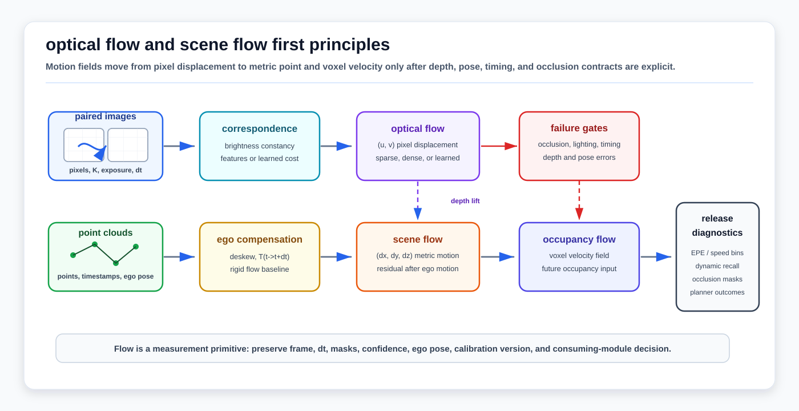

# Optical Flow and Scene Flow First Principles

<!-- kb-visual:start -->


*Visual: motion-field measurement chain from paired images, depth, poses, and point clouds through correspondence, ego-motion compensation, optical flow, scene flow, occupancy flow, and release diagnostics.*
<!-- kb-visual:end -->

Optical flow and scene flow estimate motion fields before an autonomy stack has committed to tracks, object classes, or future occupancy. Optical flow is a 2D image displacement field. Scene flow lifts that idea into 3D so points, voxels, or surfaces carry metric displacement or velocity.

This page is the motion-field layer next to [Epipolar Geometry, Homographies, and Two-View Verification](epipolar-geometry-homographies-two-view.md) and [Camera Projective Geometry, PnP, and Triangulation](camera-projective-geometry-pnp-triangulation.md). Two-view geometry asks whether image correspondences are geometrically consistent; optical and scene flow ask how pixels or points move between times, which makes them direct inputs to moving/static segmentation, occupancy flow, dynamic-map cleaning, and flow-aware planning.

---

## 1. Related Docs

- [Epipolar Geometry, Homographies, and Two-View Verification](epipolar-geometry-homographies-two-view.md)
- [Camera Projective Geometry, PnP, and Triangulation](camera-projective-geometry-pnp-triangulation.md)
- [Camera Imaging, Noise, and Calibration](camera-imaging-noise-calibration.md)
- [Rolling Shutter, LiDAR Deskew, and Motion Distortion](rolling-shutter-lidar-deskew-motion-distortion.md)
- [Correspondence Search and Data Structures](correspondence-search-data-structures.md)
- [Point Cloud Registration Math: ICP, NDT, and GICP](point-cloud-registration-math-icp-ndt-gicp.md)
- [Tracking Motion Models, Lifecycle, and Metrics](../state-estimation/tracking-motion-models-track-lifecycle-metrics.md)
- [Occupancy Flow and 4D Scene Understanding](../../30-autonomy-stack/world-models/occupancy-flow-4d-scenes.md)
- [Scene Flow Datasets and Benchmarks](../../30-autonomy-stack/world-models/scene-flow-datasets-benchmarks.md)
- [Scene Flow for Dynamic Object Removal](../../30-autonomy-stack/world-models/scene-flow-for-dynamic-object-removal.md)
- [Neural Scene Flow Priors](../../30-autonomy-stack/perception/methods/neural-scene-flow-priors.md)
- [Cross-Domain LiDAR Scene Flow](../../30-autonomy-stack/perception/methods/cross-domain-lidar-scene-flow.md)
- [Self-Supervised Occupancy Flow](../../30-autonomy-stack/world-models/self-supervised-occupancy-flow.md)

---

## 2. Why It Matters for AV, Perception, SLAM, and Mapping

| Workflow | Motion-field role | AV risk if wrong |
|---|---|---|
| Visual odometry and VIO | Optical flow supplies short-baseline image motion before feature tracks or bundle adjustment are accepted. | Dynamic objects, rolling shutter, or brightness changes can look like camera motion. |
| Stereo and depth completion | Optical flow plus disparity or depth change becomes image-domain scene flow. | Wrong depth lift turns a small pixel motion into a large metric velocity error. |
| LiDAR moving/static separation | Scene flow estimates residual 3D point motion after ego-motion compensation. | Timestamp, deskew, or pose errors can be misclassified as moving objects. |
| Occupancy flow and 4D world models | Per-point or per-voxel flow supervises dynamic occupancy and future-state prediction. | Flow errors propagate into conservative braking, missed crossing hazards, or map ghosting. |
| Dynamic map cleaning | Static points are retained while coherent residual flow is removed or isolated. | Over-removal can erase useful structure; under-removal fuses moving-object ghosts into maps. |
| Flow-aware planning | Velocity fields expose unknown or non-box-like motion before stable tracks exist. | Planners may treat a moving tug, pedestrian, or loose object as static occupancy. |

---

## 3. Inputs, Outputs, and Model Boundaries

### 3.1 Inputs

| Input | Contract |
|---|---|
| Image pair or sequence | Frames with exposure timing, camera intrinsics, distortion state, and rolling-shutter model. |
| Depth or stereo | Disparity, depth map, stereo rig baseline, monocular depth, or triangulated landmarks when lifting image flow to 3D. |
| Point clouds | Consecutive LiDAR, RGB-D, radar point, or fused point sets with timestamps and per-point sensor provenance. |
| Ego motion | `T_t_to_t+dt`, IMU/wheel/GNSS/SLAM pose interpolation, and scan-deskew metadata. |
| Correspondence proposal | Dense photometric matching, sparse feature tracks, nearest-neighbor point matching, learned correlation volume, or soft assignment. |
| Masks and priors | Occlusion masks, ground masks, semantic masks, static-map priors, object tracks, or valid-depth masks. |

### 3.2 Outputs

| Output | Meaning |
|---|---|
| Optical flow `(u, v)` | 2D image displacement from pixel `(x, y, t)` to `(x + u, y + v, t + dt)`. |
| Disparity or depth change | Change in stereo disparity or depth that lets 2D motion become 3D motion. |
| Scene flow `(dx, dy, dz)` | 3D displacement for points or surfaces between times, usually in sensor, ego, or world frame. |
| Velocity `(vx, vy, vz)` | Scene flow divided by `dt`, with frame and ego-compensation convention recorded. |
| Occupancy flow | Per-voxel motion attached to occupied grid cells or continuous occupancy fields. |
| Dynamic/static labels | Thresholded or classified residual motion after ego-motion compensation. |
| Diagnostics | Endpoint error, flow confidence, occlusion state, residual rigid-flow error, and dynamic/static precision/recall. |

### 3.3 Boundary With Tracking

Flow is not a track. A track has identity, lifecycle state, filtering, prediction, and association history. A flow vector only says how image evidence, points, or occupied cells moved between times. Flow can initialize or support tracks, but release evidence should not treat per-frame flow as object intent or identity.

---

## 4. Optical Flow First Principles

### 4.1 Brightness Constancy

For a small image displacement `(u, v)` over time step `dt`, classical optical flow starts from brightness constancy:

```text
I(x, y, t) = I(x + u, y + v, t + dt)
```

Linearizing for small motion gives the optical-flow constraint equation:

```text
I_x u + I_y v + I_t = 0
```

One equation cannot determine two unknowns. This is the aperture problem: local image evidence along an edge constrains motion normal to the edge, but not along the edge.

### 4.2 Lucas-Kanade Local Least Squares

Lucas-Kanade assumes flow is approximately constant in a small window `W`. It solves:

```text
minimize_(u,v) sum_(p in W) (I_x(p) u + I_y(p) v + I_t(p))^2
```

The normal equations are:

```text
[sum Ix^2   sum IxIy] [u] = -[sum IxIt]
[sum IxIy   sum Iy^2] [v]   [sum IyIt]
```

The window must have enough texture in two directions. If the gradient matrix is rank-deficient, the flow estimate is unobservable or unstable.

### 4.3 Horn-Schunck Global Smoothness

Horn-Schunck turns optical flow into a global variational objective:

```text
minimize_(u,v) integral (I_x u + I_y v + I_t)^2
              + alpha^2 (||grad u||^2 + ||grad v||^2) dx dy
```

The data term keeps flow consistent with brightness changes; the smoothness term spreads information into weak-texture regions. Smoothness is an assumption, not a guarantee. Motion boundaries, occlusions, reflections, and articulated objects violate it.

### 4.4 Sparse, Dense, and Learned Flow

| Family | Output | Strength | Caveat |
|---|---|---|---|
| Sparse feature flow | Motion for selected corners/features. | Efficient, good for VO/VIO and tracking. | Misses textureless, dynamic, or low-salience regions. |
| Dense variational flow | Motion for most pixels. | Useful for segmentation, depth consistency, and visualization. | Sensitive to illumination, smoothness, and occlusion assumptions. |
| Correlation-volume or transformer flow | Dense learned correspondence. | Better large-displacement and semantic matching when trained well. | Needs domain validation, confidence calibration, and geometric sanity checks. |
| Event-camera flow | Motion from asynchronous brightness-change events. | High temporal resolution and low-light fit. | Needs event-specific contrast, timestamp, and noise models. |

---

## 5. Scene Flow First Principles

### 5.1 Lifting 2D Flow to 3D

With depth `Z_t(x, y)` and camera intrinsics `K`, a pixel can be back-projected:

```text
X_t = pi^-1(x, y, Z_t, K)
X_t+dt = pi^-1(x + u, y + v, Z_t+dt, K)
scene_flow = X_t+dt - T_t+dt_t * X_t
```

The transform term depends on convention. If the point coordinates are compared in a stable world or ego frame, ego motion must be removed. If they are compared in each camera frame, the flow mixes scene motion with observer motion.

### 5.2 Rigid Flow and Residual Flow

For a static 3D point, the apparent flow is caused by ego motion:

```text
X_pred = T_t+dt_t * X_t
rigid_flow = X_pred - X_t
residual_flow = observed_flow - rigid_flow
```

Residual flow is the signal used by moving/static segmentation and dynamic map cleaning. It is also where many false positives enter: bad ego pose, time offset, LiDAR deskew error, or calibration drift produces residual motion even when the scene is static.

### 5.3 Point-Cloud Scene Flow

Point-cloud scene flow estimates a 3D vector for source points:

```text
F: P_t -> R^3
P_t_warped = {p_i + F(p_i)}
```

Common objective pieces include:

| Objective piece | Role | Failure pressure |
|---|---|---|
| Chamfer or nearest-neighbor distance | Pull warped source points toward the target cloud. | Can match to the wrong repeated surface or newly visible region. |
| Cycle consistency | Require forward and backward flow to agree. | Breaks at occlusions and disocclusions unless masked. |
| Smoothness | Encourage nearby points to move similarly. | Over-smooths object boundaries, articulated equipment, and thin structures. |
| Rigid clustering | Encourage coherent object-level motion. | Fails on deformable, articulated, or partially observed objects. |
| Ego-motion compensation | Removes expected static-scene motion. | Turns localization or timing errors into false dynamics if wrong. |

### 5.4 Occupancy Flow

Occupancy flow maps motion to voxels or continuous occupancy fields:

```text
O(x, y, z, t) -> P(occupied), class, flow_vector
```

It is a representation choice, not a separate physical law. The flow can come from LiDAR scene flow, image-derived scene flow, object tracks, radar Doppler, or a learned world model. The release question is whether the representation preserves small, slow, thin, or partially occluded hazards enough for planning.

---

## 6. Algorithm Steps

### 6.1 Image Optical Flow

1. Verify camera intrinsics, distortion handling, exposure timing, and resize metadata.
2. Convert frames into the photometric representation expected by the method.
3. Build pyramids or a coarse-to-fine schedule for large motion.
4. Estimate sparse or dense flow.
5. Produce confidence, residual, or forward/backward consistency masks.
6. Reject or downweight regions with occlusion, glare, saturation, rolling-shutter distortion, or low texture.
7. If used for geometry, cross-check with epipolar constraints and camera motion priors.

### 6.2 LiDAR or Point-Cloud Scene Flow

1. Deskew scans and transform points into a documented source frame.
2. Estimate ego motion between sweeps and remove expected static-scene motion.
3. Build point correspondences, learned correlations, or an optimization objective.
4. Estimate per-point flow and optional reverse flow.
5. Mask occlusions, disocclusions, ground ambiguity, and low-density far range.
6. Convert residual motion into dynamic/static labels only after thresholds are tied to `dt`, speed, range, and pose uncertainty.
7. Log flow vectors, confidence, masks, ego pose, calibration version, and thresholds for replay.

### 6.3 Occupancy-Flow Consumption

1. Voxelize or query continuous occupancy in a frame that planning consumes.
2. Aggregate point or image flow into cells with uncertainty and provenance.
3. Keep unknown, dynamic, static, and newly visible states distinct.
4. Pass flow-aware occupancy to prediction, planning, map cleaning, or simulation with latency metadata.
5. Evaluate downstream outcomes: missed dynamic hazards, false dynamic declarations, static-map ghosting, and planning interventions.

---

## 7. Assumptions and Domain Fit

| Domain | Good fit | Transfer caveats |
|---|---|---|
| Road AVs and robotaxis | Dense motion cues, object-independent dynamic detection, scene-flow benchmarks, and occupancy-flow forecasting. | Rain, glare, shadows, rolling shutter, high relative speeds, and occlusion-heavy urban scenes stress photometric and correspondence assumptions. |
| Airside autonomy | Low-speed GSE, personnel, aircraft pushback, jet-bridge motion, map cleaning, and unknown-object flow before a detector class exists. | Texture-poor apron pavement, reflective aircraft, de-icing mist, jet blast shimmer, and very slow motion require lower thresholds and sensor cross-checks. |
| Warehouses and logistics yards | Forklifts, pallets, trailer doors, dock alignment, and dynamic background removal in structured spaces. | Repeated racks and box patterns can create wrong correspondences; lighting flicker can break image flow. |
| Ports, mines, construction, agriculture | Dust-aware LiDAR flow, slow heavy equipment, terrain change, and moving/static map hygiene. | Dust, mud, vegetation motion, water spray, and deformable terrain can look like scene motion. |
| Delivery robots and campuses | Pedestrian/cyclist motion, curbside occupancy flow, and low-cost camera or RGB-D flow. | Low camera height amplifies occlusion and parallax; crowds need careful dynamic/static and identity separation. |

---

## 8. Failure Modes and Diagnostics

| Symptom | Likely cause | Diagnostic |
|---|---|---|
| Flow points in the right direction but wrong magnitude. | Depth error, stereo disparity noise, wrong `dt`, or unit conversion. | Plot metric velocity versus depth/range and check timestamp interval metadata. |
| Static buildings or poles appear dynamic. | Ego pose, calibration, deskew, or time synchronization error. | Recompute rigid flow from pose and inspect residual flow by range and scan ring. |
| Dynamic objects disappear into static flow. | Threshold too high, slow motion, over-smoothing, or object moving with ego direction. | Report dynamic recall by speed bucket and actor type, not only average EPE. |
| Flow bleeds across object boundaries. | Smoothness prior or voxel aggregation crosses motion boundaries. | Visualize flow discontinuities against semantic/instance masks and range images. |
| Image flow fails under lighting changes. | Brightness constancy violation from shadows, glare, HDR exposure, or thermal contrast changes. | Compare photometric residual maps to exposure, saturation, and weather metadata. |
| Newly revealed surfaces look like motion. | Disocclusion has no true correspondence in the previous frame. | Use forward/backward consistency and occlusion masks before dynamic labeling. |
| Scene flow improves EPE but hurts planning. | Benchmark metric rewards background or easy points more than rare hazards. | Add hazard-weighted, dynamic-only, small-object, and downstream planning metrics. |
| Flow confidence is high on repeated textures. | Correlation or nearest-neighbor matching found plausible but wrong surfaces. | Require geometry, temporal consistency, semantic support, or multi-sensor confirmation. |

---

## 9. Implementation Notes

- Keep the coordinate frame explicit for every flow vector. Image flow is in pixels; scene flow can be in camera, LiDAR, ego, map, or world coordinates.
- Tie thresholds to time. A 0.05 m displacement threshold over 0.1 s is a 0.5 m/s speed threshold; that can miss creeping vehicles or personnel in managed sites.
- Separate observer motion from scene motion before declaring dynamics. Rigid-flow residuals are only as good as pose, calibration, and timing.
- Preserve occlusion and disocclusion masks. Nearest-neighbor losses and forward-only flow can invent motion where no correspondence exists.
- For optical flow, document whether images were raw, rectified, undistorted, resized, or exposure-normalized. Geometry checks assume those choices are consistent.
- For point-cloud flow, log deskew settings, ego poses, point timestamps, and sensor provenance. Multi-LiDAR fusion errors often look like residual flow.
- Do not tune only on average endpoint error. Split metrics by static/dynamic, speed, range, object size, occlusion, weather, and domain.
- Treat learned flow models as measurement producers. Downstream filters and planners still need covariance, confidence, validity masks, and fail-closed behavior.

---

## 10. AV Release Evidence

Motion-field release evidence should include:

- Optical-flow evidence: photometric residuals, forward/backward consistency, texture/rank diagnostics, epipolar sanity checks, and rolling-shutter sensitivity.
- Scene-flow evidence: EPE3D or equivalent, dynamic/static precision and recall, speed-bucket splits, range splits, occlusion splits, and ego-motion sensitivity.
- Occupancy-flow evidence: future-occupancy quality, dynamic hazard recall, false dynamic declarations, planner intervention outcomes, and map-ghost reduction.
- Domain evidence: road, warehouse, yard, port, mine, farm, campus, and airside transfer splits where the same model is reused outside its source domain.
- Operational evidence: logs that preserve flow vectors, confidence, masks, ego pose, calibration version, timestamp policy, thresholds, and the consuming module decision.

---

## 11. Sources

- Berthold K. P. Horn and Brian G. Schunck, "Determining Optical Flow", Artificial Intelligence 1981 DOI record: https://doi.org/10.1016/0004-3702(81)90024-2
- Bruce D. Lucas and Takeo Kanade, "An Iterative Image Registration Technique with an Application to Stereo Vision", 1981 paper page: https://idl.uw.edu/living-papers-paper/lucas-kanade/
- OpenCV, "Optical Flow": https://docs.opencv.org/4.x/d4/dee/tutorial_optical_flow.html
- Sundar Vedula, Simon Baker, Peter Rander, Robert Collins, and Takeo Kanade, "Three-Dimensional Scene Flow", CMU Robotics Institute publication page: https://www.ri.cmu.edu/publications/three-dimensional-scene-flow-2/
- KITTI Scene Flow benchmark: https://www.cvlibs.net/datasets/kitti/eval_scene_flow.php?benchmark=scene_flow&eval_area=est&eval_gt=all
- Freiburg Scene Flow Datasets / FlyingThings3D: https://lmb.informatik.uni-freiburg.de/resources/datasets/SceneFlowDatasets/
- Argoverse 2 3D Scene Flow task: https://argoverse.github.io/user-guide/tasks/3d_scene_flow.html
- AV2 2024 Scene Flow Challenge: https://www.argoverse.org/sceneflow.html
- Waymo, "Scalable Scene Flow from Point Clouds in the Real World": https://waymo.com/research/scalable-scene-flow-from-point-clouds-in-the-real-world/
- ZeroFlow project page: https://vedder.io/zeroflow.html
- DeFlow official repository: https://github.com/KTH-RPL/DeFlow
