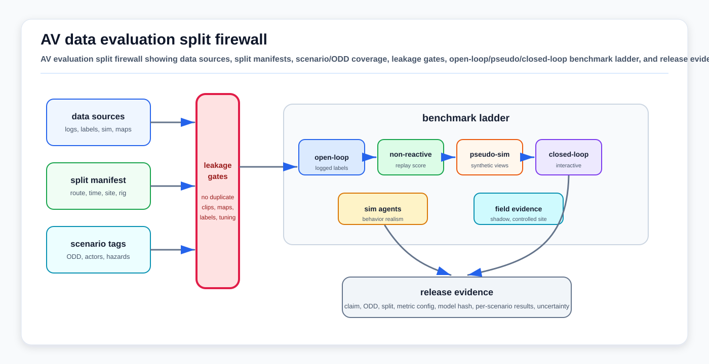

# AV Data Evaluation Fundamentals

<!-- kb-visual:start -->


*Visual: AV evaluation split firewall showing data sources, split manifests, scenario/ODD coverage, leakage gates, open-loop/pseudo/closed-loop benchmark ladder, and release evidence.*
<!-- kb-visual:end -->

## Related Docs

- [Evaluation, Calibration, and Data Leakage: First Principles](evaluation-calibration-and-data-leakage-first-principles.md)
- [World-Model Evaluation and Planning Objectives](world-model-evaluation-and-planning-objectives-first-principles.md)
- [Benchmarking, Metrics, and Statistical Validity](../systems-engineering/benchmarking-metrics-statistical-validity.md)
- [Evaluation Benchmarks for End-to-End Driving: NAVSIM, Bench2Drive, and Airside Transfer](../../30-autonomy-stack/end-to-end-driving/evaluation-benchmarks-navsim-bench2drive.md)
- [Evaluation Methods, Benchmarks, and Metrics for World Models and Autonomous Driving](../../60-safety-validation/verification-validation/evaluation-benchmarks.md)
- [Safety-Critical Scenario Libraries](../../60-safety-validation/verification-validation/safety-critical-scenario-libraries.md)

## Why It Matters

AV data evaluation is the contract between a claim and the evidence used to support it. A dataset split, benchmark score, scenario label, or closed-loop metric only means something when it is tied to the model, task, ODD, protocol, metric, uncertainty, and release decision being made.

The failure mode is not just overfitting. A system can improve an offline benchmark while exploiting near-duplicate frames, map-version leakage, route familiarity, simulator artifacts, repeated submissions, weak scenario tags, or an open-loop metric that does not represent closed-loop behavior. AV evaluation therefore has to bind data lineage, split hygiene, scenario and ODD coverage, benchmark semantics, and release artifacts into one auditable package.

This page is narrower than the general ML leakage and calibration note. It focuses on AV-specific evidence design: logged driving data, scenario libraries, simulator and pseudo-simulator benchmarks, public leaderboard interpretation, cross-domain transfer, and the release bundle expected before a learned autonomy component is promoted.

## Evaluation Claim Contract

Start by writing the claim before selecting the metric:

```text
claim =
  system or component
  + task and interface
  + ODD and scenario family
  + data source and split rule
  + benchmark or protocol version
  + metric and uncertainty
  + release decision
```

Examples:

- A planner has better route progress in real-log pseudo-simulation without increasing collisions on held-out rainy urban scenes.
- A perception stack has higher pedestrian recall at fixed false positives per hour on unseen night sites.
- A VLA policy has lower intervention rate in closed-loop simulator routes that include held-out construction and cut-in scenarios.
- An airside tug planner completes stand-entry routes in a digital twin while respecting aircraft, personnel, and hold-line gates.

A score without the claim is not release evidence. It may still be a useful regression signal, but it cannot justify deployment scope.

## Split And Leakage Firewall

AV data often contains correlated frames, repeated routes, repeated actors, reused maps, and shared simulator generators. Random frame splits are usually too weak for deployment claims.

Useful split units include:

| Generalization claim | Split unit |
|---|---|
| Same site, new time | Date, shift, season, lighting, and weather block |
| New route or operational zone | Route ID, lane graph region, stand, dock, yard block, or mine segment |
| New geography | City, airport, warehouse, port, mine, or farm site |
| New sensor state | Vehicle ID, sensor rig, calibration ID, firmware, cleaning state, or mounting revision |
| New map state | Map version, lane graph version, semantic layer version, construction closure, or temporary geofence |
| New scenario family | Scenario tag, hazard family, actor interaction, failure trigger, or safety requirement |
| New simulator behavior | Generator seed, simulator version, agent policy, scenario template, map, and asset pack |

The split manifest is a release artifact, not a convenience file. It should record:

```text
dataset version
source logs and lineage
split IDs and split rationale
scenario and ODD tags
map and calibration versions
label, pseudo-label, and annotation-tool versions
preprocessing and feature-extraction commits
benchmark version and metric configuration
model checkpoint, threshold, temperature, and policy hash
submission count and tuning history
known exclusions and blocked-access gaps
```

Leakage gates should explicitly check near-duplicate frames, clips from the same route traversal, repeated rare events, copied pseudo-labels, shared human-review batches, train-time access to test maps or scenario labels, leaderboard-driven threshold tuning, and simulator assets reused across training and held-out tests.

## Scenario And ODD Coverage

Scenario coverage is the bridge between logged data and safety meaning. ISO 34502 defines a scenario-based ADS safety evaluation framework for road vehicles. ASAM OpenODD provides a way to describe the operational design domain. ASAM OpenSCENARIO DSL provides an executable scenario-description layer for abstract, logical, and concrete scenarios.

For AV data evaluation, use three levels:

| Level | What it captures | Evaluation use |
|---|---|---|
| Abstract scenario | Natural-language family such as "vehicle cuts in" or "baggage tractor merges at stand entry" | Backlog, safety case, coverage target |
| Logical scenario | Parameter ranges for actors, speeds, weather, lighting, topology, and margins | Coverage analysis and test generation |
| Concrete scenario | Fixed initial state, actors, map, timing, and oracle | Replay, simulator test, regression, release gate |

ODD coverage should be reported by scenario family, environment, infrastructure, sensor state, traffic or actor density, map state, and authority boundary. Aggregates are not enough: a high mean score can hide a total miss on a small but safety-critical slice.

## Evaluation Ladder

Use the cheapest protocol that can support the claim, but do not let cheaper protocols stand in for interaction evidence.

| Layer | What it tests | Main use | Main limitation |
|---|---|---|---|
| Offline/open-loop | Predictions against logged labels or futures | Fast training and regression | Logged future is only one possible outcome |
| Non-reactive replay | Ego trajectory scored against real scene without reactive agents | Cheap planning sanity check on real logs | Other actors do not respond to ego behavior |
| Pseudo-simulation | Real-data benchmark with synthetic observations or approximated future states | Scalable planner and E2E comparison | Still approximates interaction and reconstruction |
| Closed-loop simulator | Ego actions affect future observations and agents | Compounding-error, recovery, progress, and interaction evidence | Sim-to-real and behavior-model realism gaps |
| Sim-agent realism | Generated agents or futures evaluated for realism | Scenario generation and behavior-model validation | Not the same as proving ego stack safety |
| Controlled site and shadow mode | Real sensors, maps, operators, and procedures | Release evidence and ODD-specific risk burn-down | Expensive, harder to repeat, limited rare-event rate |

Open-loop evidence is necessary for ML development. Closed-loop and controlled-site evidence are necessary for claims about autonomy behavior under interaction, recovery, fallback, and rule compliance.

## Public Benchmark Interpretation

Public benchmarks are useful when their protocol matches the claim. They are weak when treated as generic proof of readiness.

| Benchmark or source | What it is good for | Interpretation caveat |
|---|---|---|
| NAVSIM | Real-data non-reactive and pseudo-simulation evaluation for autonomous driving planners and E2E systems | Good planning evidence, but not full interaction or domain transfer proof |
| Bench2Drive | Closed-loop CARLA benchmark with multi-ability routes and rich annotations | Good interaction stress test, but simulator and road-domain assumptions remain |
| CARLA Leaderboard | Closed-loop route completion, infraction, and driving-score style evaluation | Useful for full-stack route behavior, but CARLA-specific artifacts and route rules matter |
| Waymo Open Dataset | Large public AV perception, motion, E2E, and scenario-generation benchmark ecosystem | Strong road-data reference, but leaderboard metrics and yearly tracks must be read by task |
| Waymo Open Sim Agents | Challenge for realistic future behavior of all agents in scenarios | Measures behavior realism, not direct ego-stack deployment safety |
| nuPlan | Open-loop and closed-loop planner benchmark on real-world driving data | Useful planner benchmark, but still road-domain and protocol-bound |

Public road benchmarks transfer as methodology to warehouses, yards, ports, mines, construction sites, farms, campuses, delivery robots, and airside autonomy. They do not transfer their ODD, actor ontology, rules, or safety oracles.

## Domain Fit

| Domain | Data-evaluation focus |
|---|---|
| Road AV | City, route, weather, traffic-density, map-version, and vulnerable-road-user splits; public benchmarks are most directly aligned here. |
| Airside | Aircraft, GSE, personnel, stand, service-road, jet-blast, FOD, marshalling, clearance, and airport-rule coverage; public road benchmarks provide evaluation patterns, not sufficient evidence. |
| Warehouse, yard, and port autonomy | Dock, aisle, trailer, container, pedestrian, forklift, gate, and mixed-manual-traffic coverage; route/task progress and near-field safety gates matter more than public-road rules. |
| Mining, construction, and agriculture | Site phase, haul road, implement, terrain, dust, slope, GNSS degradation, and exclusion-zone coverage; rare physical hazards need controlled-site evidence. |
| Campus and delivery robots | Sidewalk, curb, doorway, pedestrian, accessibility, weather, and municipal-rule coverage; human-interaction slices should not be hidden in mean route scores. |

## Failure Modes

| Failure mode | Symptom | Control |
|---|---|---|
| Random-frame leakage | Validation looks strong while new routes or new days fail | Split by route, time, site, and clip family |
| Map-version leakage | Planner appears robust because train and test share map artifacts | Bind data to map version and hold out map changes |
| Scenario undercoverage | Mean score improves while a hazard class regresses | Report metrics by scenario family and ODD tag |
| Open-loop optimism | Low trajectory error but poor recovery or progress in simulator | Require pseudo-sim, closed-loop, or controlled-site evidence for behavior claims |
| Leaderboard tuning | Private test improves through repeated submissions rather than generalization | Track submissions, freeze thresholds, preserve untouched holdouts |
| Simulator exploitation | Policy learns renderer, agent, or route artifacts | Cross-simulator checks, real-log pseudo-sim, and controlled real tests |
| Weak uncertainty | Metric difference is smaller than run-to-run variance | Confidence intervals, paired tests, and seed/run manifests |
| Domain overclaim | Road benchmark score is used as airside, yard, or mining readiness | State domain transfer limits and build domain-specific oracles |

## Implementation Checklist

- Write the release claim before choosing metrics.
- Define split units that match the generalization claim.
- Store a split manifest with data, map, calibration, label, benchmark, model, and threshold versions.
- Report scenario and ODD coverage before aggregate scores.
- Separate open-loop, non-reactive, pseudo-sim, closed-loop, sim-agent, shadow, and controlled-site results.
- Preserve per-scenario traces, safety-gate outcomes, planner/controller states, and intervention labels.
- Freeze benchmark and metric versions for release comparisons.
- Track public leaderboard submission count and tuning decisions.
- Require statistical uncertainty for comparisons that affect release decisions.
- Record blocked source or dataset access as a gap instead of filling it with inferred claims.

## Release Artifact Bundle

A reviewable AV evaluation package should include:

```text
claim statement
ODD and scenario taxonomy
dataset and split manifest
data lineage and consent/retention constraints
map, calibration, and sensor-health versions
annotation and pseudo-label provenance
benchmark and simulator versions
metric implementation and threshold config
model checkpoint and runtime configuration
per-scenario score tables
uncertainty intervals and regression analysis
known exclusions and blocked gaps
release decision and owner sign-off
```

The bundle should make it possible to answer a concrete question: "What exactly did this evidence prove, for which autonomy component, in which ODD, under which split and metric assumptions?"

## Sources

- ISO, [ISO 34502:2022 Road vehicles - Test scenarios for automated driving systems - Scenario based safety evaluation framework](https://www.iso.org/standard/78951.html).
- ASAM, [ASAM OpenODD](https://www.asam.net/standards/detail/openodd/).
- ASAM, [ASAM OpenSCENARIO DSL latest specification](https://publications.pages.asam.net/standards/ASAM_OpenSCENARIO/ASAM_OpenSCENARIO_DSL/latest/index.html).
- Autonomous Vision, [NAVSIM official repository](https://github.com/autonomousvision/navsim).
- Thinklab-SJTU, [Bench2Drive official repository](https://github.com/Thinklab-SJTU/Bench2Drive).
- CARLA, [Evaluation Criteria for the Leaderboard 2.0](https://leaderboard.carla.org/evaluation_v2_0/).
- Waymo, [The Waymo Open Sim Agents Challenge](https://waymo.com/research/the-waymo-open-sim-agents-challenge/).
- Waymo, [Waymo Open Dataset about page](https://waymo.com/open/about/).
- Waymo, [Waymo Open Dataset 2025 Challenge terms and metrics](https://waymo.com/open/terms/).
- Motional, [nuPlan](https://www.nuplan.org/).
