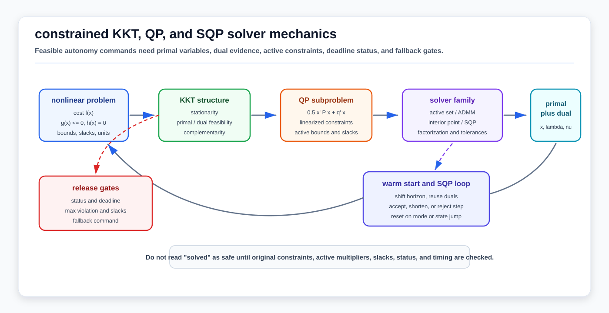

# Constrained KKT, QP, and SQP Solver Mechanics

<!-- kb-visual:start -->


*Visual: constrained solver loop from nonlinear objective and constraints through KKT conditions, QP subproblems, active-set/ADMM/interior-point/SQP solve states, warm starts, and release diagnostics.*
<!-- kb-visual:end -->

Constrained optimization is the layer where an autonomy stack stops asking only "what minimizes the cost?" and starts asking "what minimizes the cost while staying feasible?" In AV systems that distinction matters for MPC, CBF safety filters, docking, trajectory optimization, calibration bounds, map alignment limits, and runtime fallback policies.

This page covers the solver mechanics that sit below the control-oriented [Constrained Optimization, MPC, and iLQR](../controls/constrained-optimization-mpc-ilqr-first-principles.md) page. The controls page explains why receding-horizon and local trajectory methods matter; this page explains the KKT objects, QP subproblems, active sets, dual variables, SQP loops, and solver telemetry that make constrained solves reviewable.

---

## 1. Related Docs

- [Constrained Optimization, MPC, and iLQR](../controls/constrained-optimization-mpc-ilqr-first-principles.md)
- [Solver Selection and Convergence Diagnosis](solver-selection-and-convergence-diagnosis.md)
- [Nonlinear Solver Diagnostics Crosswalk](nonlinear-solver-diagnostics-crosswalk.md)
- [Objective and Residual Design Audit](objective-residual-design-and-audit.md)
- [Trust Region, Line Search, and Globalization](trust-region-line-search-globalization.md)
- [Jacobians, Autodiff, Manifolds, and Linearization](jacobians-autodiff-manifold-linearization.md)
- [Sparse Estimation Backend Crosswalk](../numerical-linear-algebra/sparse-estimation-backend-crosswalk.md)
- [Safety-Critical Planning with CBFs](../../30-autonomy-stack/planning/safety-critical-planning-cbf.md)
- [Trajectory Tracking Control](../../30-autonomy-stack/planning/trajectory-tracking-control.md)

---

## 2. Why It Matters for AV, Perception, SLAM, and Mapping

| Workflow | Constraint role | AV risk if wrong |
|---|---|---|
| Tracking MPC | Enforces actuator, curvature, acceleration, jerk, and corridor limits while optimizing tracking error. | A low tracking cost can still violate physical limits or return a late command. |
| CBF safety filters | Solves a small QP that minimally modifies a nominal command while satisfying safety inequalities. | Infeasibility, stale warm starts, or hidden slacks can turn a safety filter into an unlogged override. |
| Trajectory optimization | Converts nonlinear dynamics and obstacle rules into local QP or NLP steps. | The solver may converge to a smooth local minimum that is outside the true safe corridor. |
| Calibration and parameter fitting | Keeps intrinsics, extrinsics, time offsets, and vehicle parameters inside physical bounds. | Bound violations can be hidden by unconstrained solvers or by penalties that are too weak. |
| Map and localization QA | Uses equality and inequality constraints for priors, gauge choices, lane/curb constraints, or protection bounds. | Misread duals or active constraints can create false confidence about observability. |
| Runtime validation | Interprets solver status, residuals, violation, slacks, and deadline behavior. | "Solved" can mean numerically acceptable under tolerances, not operationally safe. |

---

## 3. Inputs, Outputs, and Solver Contract

### 3.1 Inputs

| Input | Contract |
|---|---|
| Decision vector `x` | State, controls, parameters, trajectory knots, calibration variables, or slack variables with units and bounds. |
| Objective `f(x)` | Scalar cost with documented scaling, weights, units, and soft-constraint penalties. |
| Equality constraints `h(x) = 0` | Dynamics, kinematic closure, calibration equations, gauge constraints, or consistency equations. |
| Inequality constraints `g(x) <= 0` | Bounds, clearance, friction, safety barriers, actuator limits, comfort limits, or route envelopes. |
| Derivatives | Gradients, Jacobians, Hessian or Hessian approximation, sparsity pattern, and tangent-space convention. |
| Warm start | Previous primal variables, dual variables, active set, barrier state, ADMM variables, or shifted MPC solution. |
| Solver policy | Tolerances, max iterations, deadline, scaling, regularization, infeasibility handling, and fallback action. |

### 3.2 Outputs

| Output | Meaning |
|---|---|
| Primal solution | Candidate state, parameter, trajectory, or command. |
| Dual variables | Multipliers for active constraints; useful for diagnosing which limits are controlling the solve. |
| Active set or barrier state | The constraints treated as binding, or the interior-point/barrier progress toward complementarity. |
| QP/NLP status | Solved, inaccurate solved, max iterations, infeasible, unbounded, restoration failed, timeout, or user-interrupted. |
| Residual telemetry | Primal residual, dual residual, complementarity, objective, gradient norm, constraint violation, and slack values. |
| Runtime telemetry | Setup time, factorization time, solve time, iterations, warm-start reuse, refactorizations, and fallback command. |

### 3.3 Contract Boundary

A constrained solver does not decide which constraints are product requirements. It only solves the problem written down. If collision avoidance is encoded as a soft penalty, the solver is allowed to trade it against comfort or tracking. If collision avoidance is a hard constraint, the system must still define what happens when the problem becomes infeasible or misses its deadline.

---

## 4. KKT Conditions from First Principles

For a nonlinear constrained problem:

```text
minimize_x   f(x)
subject to   g_i(x) <= 0
             h_j(x) = 0
```

the Lagrangian is:

```text
L(x, lambda, nu) = f(x) + sum_i lambda_i g_i(x) + sum_j nu_j h_j(x)
```

At a regular local optimum, the Karush-Kuhn-Tucker conditions are:

```text
stationarity:       grad_x L(x, lambda, nu) = 0
primal feasibility: g_i(x) <= 0, h_j(x) = 0
dual feasibility:   lambda_i >= 0
complementarity:    lambda_i g_i(x) = 0
```

Complementarity gives the key operational signal. An inequality constraint is either inactive with `lambda_i = 0`, or active with `g_i(x) = 0`. In a controller, active multipliers show which limits are binding: steering rate, braking, clearance, friction, or safety-filter constraints. In calibration, they show whether a physical bound is shaping the result instead of the data.

KKT conditions require constraint qualifications such as independent active constraint gradients. If active constraints are nearly dependent, the solver can report unstable multipliers, poor conditioning, or inconsistent active-set decisions even when the primal solution looks plausible.

---

## 5. Quadratic Programs

A convex QP has a quadratic objective and linear constraints. One common form, used by OSQP, is:

```text
minimize_x   0.5 x^T P x + q^T x
subject to   l <= A x <= u
```

This form covers equalities by setting `l_i = u_i`, lower or upper bounds by setting one side infinite, and box constraints by using rows of `A` that select variables.

The equality-constrained KKT system for a simple QP is:

```text
[ P  A^T ] [ dx ] = -[ grad ]
[ A   0  ] [ dy ]    [ con  ]
```

Production solvers usually add regularization, scaling, inequality handling, and sparse factorizations. OSQP, for example, solves regularized quasi-definite linear systems inside an ADMM loop and reports primal and dual residuals. Active-set solvers instead guess or update the active constraints and solve equality-constrained QPs for that working set. Interior-point solvers keep iterates inside the feasible interior while driving barrier and complementarity terms toward zero.

### 5.1 What a QP Status Means

| Status evidence | What it says | What it does not say |
|---|---|---|
| Primal residual small | Linear constraints are satisfied within tolerance. | Nonlinear source constraints were valid after linearization. |
| Dual residual small | Stationarity holds within the solver model. | The objective or constraint scaling is operationally meaningful. |
| Complementarity small | Active/inactive inequality logic is numerically consistent. | The right constraints were chosen for the product requirement. |
| Infeasibility certificate | The written QP has no feasible point under the solver assumptions. | The real vehicle is unsafe; the model may be too conservative, stale, or wrongly linearized. |
| Polished active set | A guessed active set gave a higher-accuracy local result. | The active set will remain stable next control cycle. |

---

## 6. SQP and Sequential Convex Mechanics

Sequential quadratic programming solves a nonlinear constrained problem by repeatedly solving QP subproblems. At iteration `k`, it:

1. Linearizes constraints around the current point.
2. Builds or approximates the Hessian of the Lagrangian.
3. Solves a QP step for `delta x`.
4. Accepts, shortens, or rejects the step using a merit function, filter, trust region, or line search.
5. Updates primal and dual variables, then repeats.

The local QP often looks like:

```text
minimize_delta   grad f_k^T delta + 0.5 delta^T B_k delta
subject to       h_k + J_h,k delta = 0
                 g_k + J_g,k delta <= 0
```

where `B_k` approximates the Lagrangian Hessian. For nonlinear MPC, this becomes a structured optimal-control problem with dynamics constraints, path constraints, stage costs, and terminal terms. acados documents this OCP-NLP and QP-subproblem structure explicitly because real-time MPC depends on preserving that structure.

### 6.1 Real-Time Iteration, Condensing, and Warm Starts

MPC solvers exploit repetition:

- Shift the previous state/control trajectory forward by one cycle.
- Reuse primal, dual, and active-set information when the operating mode is continuous.
- Condense or partially condense dynamics to reduce the QP size, while preserving sparsity when full condensing is too dense.
- Run one SQP or real-time-iteration step per control cycle when deadlines matter more than full convergence.
- Treat mode changes, emergency stops, poor localization, or large reference jumps as warm-start reset triggers.

Warm starts are a performance feature, not a correctness proof. A stale active set or shifted solution can bias the solve toward yesterday's constraints.

---

## 7. Solver Families

| Family | Core idea | Good fit | AV caveat |
|---|---|---|---|
| Active-set QP | Maintain a working set of constraints treated as active and solve equality-constrained subproblems. | Small MPC and safety-filter QPs with stable active sets and strong warm starts. | Constraint chatter or nearly dependent active rows can cause command jitter. |
| Operator splitting / ADMM | Split QP objective and constraints into easier substeps with primal and dual residual convergence checks. | Robust embedded convex QPs, code generation, and broad warm-started MPC use. | More iterations may be needed for high accuracy; residual tolerances must match control risk. |
| Interior-point | Follow a barrier path while reducing primal residual, dual residual, and complementarity. | Large sparse QP/NLP solves and offline or medium-rate trajectory optimization. | Barrier failure or restoration status needs explicit fallback interpretation. |
| SQP | Solve a sequence of QPs for a nonlinear constrained problem. | Nonlinear MPC, vehicle dynamics, trajectory optimization, and calibration with bounds. | Linearized constraints can be trusted only near the current trajectory. |
| Sequential convex programming | Convexify nonconvex obstacles, dynamics, or trust regions repeatedly. | Planning with nonconvex geometry when initialized by search, lattice, or previous plan. | Convexification can hide the true nonconvex risk; independent trajectory validation remains required. |

---

## 8. Domain Fit

| Domain | Fit |
|---|---|
| Outdoor road AV | High: MPC, CBF-QP, lane corridor constraints, friction limits, docking, and emergency maneuvers all need constrained-solver telemetry. |
| Airside | High: low-speed precision, aircraft keepouts, wet-apron friction, docking, pushback envelopes, and GSE interaction make active constraints safety-relevant. |
| Warehouse, yard, and port autonomy | High: narrow aisles, trailer/container clearances, backing maneuvers, and mixed human/vehicle traffic favor explicit feasibility and fallback logic. |
| Mining, construction, and agriculture | Medium to high: terrain, payload, slope, and traction constraints matter, but models may be less smooth and require conservative validation. |
| Delivery robots and campuses | Medium: small platforms need sidewalk clearance, curb, pedestrian, and actuator constraints, often with tight compute budgets. |
| Pure perception training | Supporting: constrained solvers are less central than training optimizers, but calibration, geometric supervision, and post-processing can still use constrained QPs/NLPs. |

---

## 9. Failure Modes and Diagnostics

| Failure | Cause | Diagnostic |
|---|---|---|
| "Solved" command violates product rule | The product rule was a soft cost, not a hard constraint. | Inspect active constraints, slack values, and per-term objective contributions. |
| Repeated infeasible QPs | Linearized constraints conflict, warm start is stale, or the real request is physically impossible. | Replay constraint residuals, active rows, and fallback command for the same state. |
| Constraint chatter | Active set flips between nearly equivalent constraints over cycles. | Plot active constraints and multipliers over time; add hysteresis or improve scaling only after model review. |
| Tiny residuals but unsafe trajectory | The local convexification missed the nonconvex obstacle or drivable-area geometry. | Validate the returned trajectory against the original nonlinear geometry. |
| Late optimal command | Solver reaches a good solution after the control deadline. | Treat timeout or overrun as a control fault and log fallback behavior. |
| Dual multipliers unstable | Active constraint gradients are nearly dependent or badly scaled. | Check active Jacobian rank, row scaling, and constraint qualification. |
| Slack hides safety violation | A hard safety rule was softened or slack penalties were too low. | Separate comfort, route, and collision slacks; set release gates per slack family. |
| Warm start causes biased solve | Previous mode, reference, or active set no longer matches current state. | Reset warm start on mode changes, large state jumps, or emergency/fallback transitions. |

---

## 10. Implementation Checklist

- State the exact problem form: variables, objective, equality constraints, inequality constraints, bounds, slacks, and units.
- Log primal residual, dual residual, complementarity, max constraint violation, objective, status, iteration count, and solve time for every runtime solve.
- Store active constraints and dual multipliers where the solver exposes them.
- Keep hard safety constraints separate from comfort and smoothness penalties.
- Define a fallback command for infeasible, inaccurate, timed-out, or stale solves before deployment.
- Scale variables and constraints so one unit family does not dominate residual or multiplier interpretation.
- Validate QP solutions against the original nonlinear constraints after SQP or sequential convex steps.
- Use warm starts only with reset conditions tied to mode, reference, state jump, localization health, and actuation fault state.
- Treat solver status as evidence, not proof. Pair it with downstream trajectory, clearance, and actuator validation.

---

## 11. Source-Backed Release Evidence

| Evidence | Why it is needed |
|---|---|
| Problem-form snapshot | Lets reviewers reproduce exactly what was solved at a failure frame. |
| Solver-status distribution | Shows how often solved, inaccurate, infeasible, max-iteration, and timeout paths occur by ODD slice. |
| Constraint-violation histogram | Separates numerical tolerance from operational margin. |
| Active-constraint timeline | Reveals whether steering, braking, friction, CBF, or corridor limits dominate behavior. |
| Slack-family report | Prevents comfort slack and collision slack from being collapsed into one "feasible" label. |
| Deadline and fallback log | Shows whether late solves are safely handled instead of silently applied. |
| Nonlinear validation replay | Confirms SQP or convexified solutions against original dynamics, obstacle, route, and actuator constraints. |

---

## 12. Sources

- OSQP documentation, "The solver": https://osqp.org/docs/solver/index.html
- acados documentation, "Problem Formulation": https://docs.acados.org/problem_formulation/index.html
- CasADi documentation: https://web.casadi.org/docs/
- Ipopt documentation: https://coin-or.github.io/Ipopt/
- qpOASES User's Manual: https://www.coin-or.org/qpOASES/doc/3.2/manual.pdf
- UCSD Optimization Software, SNOPT: https://ccom.ucsd.edu/~optimizers/solvers/snopt/
- Stephen Boyd and Lieven Vandenberghe, "Convex Optimization": https://www.seas.ucla.edu/~vandenbe/cvxbook.html
- James B. Rawlings, David Q. Mayne, and Moritz M. Diehl, "Model Predictive Control: Theory, Computation, and Design": https://sites.engineering.ucsb.edu/~jbraw/mpc/
