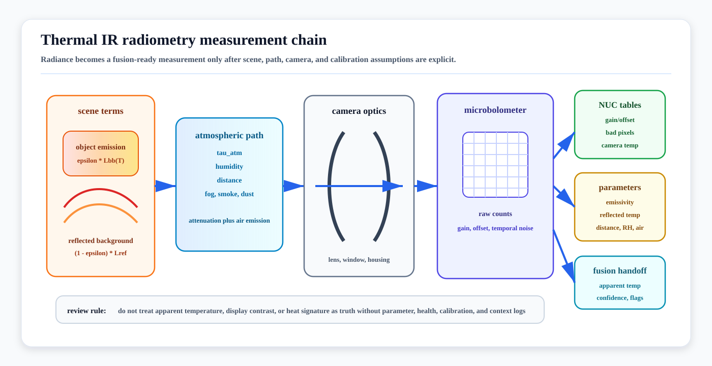

# Thermal IR Radiometry First Principles

<!-- kb-visual:start -->


*Visual: thermal IR radiometry measurement chain showing scene emission, reflected background, atmospheric path, optics, microbolometer response, NUC tables, radiometric parameters, and fusion-ready confidence.*
<!-- kb-visual:end -->

Thermal infrared cameras do not measure object class or true temperature
directly. They measure infrared radiance at the detector, then convert that
signal into image intensity or apparent temperature using calibration tables,
scene parameters, and assumptions about emissivity, reflection, atmosphere,
optics, and camera drift.

The useful autonomy contract is therefore: "this pixel or feature is a
radiance-derived measurement with known parameters, uncertainty, health state,
and validity limits," not simply "thermal sees heat."

---

## Related docs

- [Sensor Likelihoods, Noise, and Error Budgets](sensor-likelihoods-noise-error-budgets.md)
- [Event and Thermal Camera Models](../geometry-3d/event-thermal-camera-models.md)
- [Camera Imaging Noise and Calibration](../geometry-3d/camera-imaging-noise-calibration.md)
- [Sensor Calibration and Time Synchronization](../geometry-3d/sensor-calibration-time-synchronization.md)
- [Thermal and Infrared Cameras for Airside Autonomous Vehicles](../../20-av-platform/sensors/thermal-ir-cameras.md)
- [Night Operations Perception and Thermal-LiDAR Fusion Architecture](../../30-autonomy-stack/perception/overview/night-operations-thermal-fusion.md)
- [Thermal-Inertial SLAM and Odometry](../../30-autonomy-stack/localization-mapping/slam-methods/thermal-inertial-slam.md)

---

## Why it matters for AV, perception, SLAM, and mapping

Thermal IR is valuable because it observes emitted long-wave or mid-wave
radiation rather than reflected visible light. It can improve night, smoke,
fog, dust, glare, and low-illumination operation. It can also fail quietly
when the stack treats apparent temperature or thermal contrast as a stable
semantic fact.

Radiometry matters when a system uses thermal data for:

- night pedestrian, vehicle, animal, and equipment detection
- hot engine, brake, tire, battery, motor, or fire monitoring
- jet-blast, exhaust, and industrial heat-source awareness
- thermal-inertial odometry, RGB-thermal matching, or thermal map layers
- degraded-mode confidence, sensor health monitoring, and validation evidence

For autonomy review, the core question is whether thermal outputs are carried
with enough context for downstream modules to know when they are trustworthy.

---

## Measurement contract

Typical inputs:

- raw or processed thermal frame, bit depth, frame time, and exposure/integration state
- spectral band, lens/window material, optics transmission, and detector type
- camera internal temperature, NUC/FFC state, bad-pixel map, and calibration table ID
- object distance, emissivity assumption, reflected apparent temperature, atmospheric temperature, humidity, and path length where radiometry is used
- camera intrinsics, distortion, extrinsics, timestamp offset, and synchronization source
- optional reference target, blackbody check, or fleet health baseline

Typical outputs:

- thermal intensity, radiance estimate, or apparent temperature per pixel
- feature, detection, track, free-space cue, or thermal residual
- validity and health flags: NUC event, saturation, low contrast, dead pixels, lens obstruction, stale frame, bad radiometric parameters
- confidence, covariance, or quality score for fusion
- provenance: radiometric versus contrast-only mode, parameter set, calibration version, and preprocessing path

The downstream consumer should know whether it is receiving true radiometric
temperature estimates, relative thermal contrast, 8-bit display imagery, or a
learned feature derived from a normalized frame.

---

## Radiance model

For an opaque surface observed by a thermal camera, a compact radiometry model
is:

```text
L_sensor =
  tau_atm * [epsilon * L_bb(T_object)
             + (1 - epsilon) * L_reflected]
  + (1 - tau_atm) * L_atmosphere
  + L_optics
  + sensor_offset
  + noise
```

where:

- `epsilon` is target emissivity
- `L_bb(T_object)` is blackbody radiance at object temperature
- `L_reflected` is reflected apparent radiance from surroundings
- `tau_atm` is path transmission through air, humidity, smoke, fog, or dust
- `L_atmosphere` is radiance emitted by the air path
- `L_optics` includes lens, window, housing, and internal camera contributions

FLIR thermography documentation frames accurate temperature measurement around
object parameters such as emissivity, reflected apparent temperature, distance,
relative humidity, and atmospheric temperature. ASTM E1933 similarly treats
emissivity as a field or laboratory compensation problem for infrared imaging
radiometers.

For AV perception, many tasks need only stable contrast or feature evidence.
For thermal safety claims, asset-temperature checks, fire detection, battery
monitoring, and thermal maps, radiometric parameters and their uncertainty
must be logged.

---

## Detector and signal chain

Most compact vehicle-relevant LWIR cameras use uncooled microbolometers. A
microbolometer pixel absorbs incoming IR energy, changes temperature slightly,
and changes electrical resistance. The readout chain converts that response
to digital counts:

```text
scene radiance
-> lens/window transmission
-> microbolometer membrane heating
-> resistance/readout change
-> raw digital number
-> NUC/bad-pixel/temperature compensation
-> radiometric frame or display image
-> perception, tracking, mapping, or health monitor
```

Common signal products:

- raw counts or 14/16-bit radiometric frames
- non-uniformity-corrected frames
- automatic-gain-control display imagery
- apparent temperature image
- dead-pixel mask and NUC/FFC event metadata

Automatic gain control and 8-bit display images can help a human view the
scene, but they may destroy temporal and radiometric consistency. Direct
thermal-inertial odometry, trend monitoring, and validation should preserve raw
or radiometric data when the hardware exposes it.

---

## NUC, FFC, and calibration tables

Thermal detectors have pixel-to-pixel gain and offset variation. Non-uniformity
correction (NUC) or flat-field correction (FFC) compensates for this variation
and for drift as the camera temperature changes.

A simplified pixel correction is:

```text
DN_corrected(u) =
  gain(u, T_camera, table_id) * DN_raw(u)
  + offset(u, T_camera, table_id)
```

FLIR's OEM support material describes factory calibration against blackbody
sources, pixel gain/offset terms, NUC tables, and table selection by camera
internal temperature. FLIR's public NUC explainer also notes that NUC is used
to adjust for detector drift as scene and environment change.

Operational implications:

- A NUC/FFC event can create a frame jump, short blind interval, or feature
  discontinuity.
- Warm-up state matters; a camera at the same ambient temperature can still
  have different internal thermal distributions.
- Shutterless systems avoid a mechanical interruption but still need drift
  compensation and evidence that the compensation remains stable.
- Bad-pixel maps and NUC table IDs are part of the measurement provenance, not
  only factory metadata.

Recent work on uncooled shutterless microbolometer cameras shows why long-term
radiometric stability depends on camera thermal state, housing/optics
contributions, and calibration model validity. Vehicle deployments should
therefore monitor camera temperature and residual behavior rather than assuming
factory calibration alone covers every environment.

---

## Error budget and likelihood

A thermal measurement residual is usually not dominated by a single noise
source. A useful error budget separates:

| Error source | Autonomy effect |
|---|---|
| NETD and temporal noise | Small temperature differences become low-SNR features. |
| Fixed-pattern residual | Stripes, columns, or pixel texture become false features. |
| Emissivity error | Apparent temperature differs from true surface temperature. |
| Reflected apparent temperature | Shiny metal, glass, water, and wet pavement create false hot or cold objects. |
| Atmospheric path | Fog, humidity, smoke, rain, steam, dust, distance, and hot exhaust change received radiance. |
| Optics/window emission | Lens, germanium window, housing, heater, or contamination adds scene-independent bias. |
| NUC/FFC event | Frame discontinuity or temporary blindness breaks tracking. |
| Geometric calibration and timing | Thermal boxes, LiDAR points, and RGB features fail to align. |
| Dynamic range and saturation | Fires, brakes, sun-heated surfaces, or engines clip or compress nearby contrast. |

For a detector, track, or SLAM residual, the likelihood should be conditioned
on operating context:

```text
R_thermal =
  R_detector_noise
  + R_radiometric_parameters
  + R_calibration
  + R_timing
  + R_environment
  + R_preprocessing
```

If the frame is contrast-only rather than radiometric, do not report a
temperature covariance. Use detection confidence, feature residuals, or a
context-specific measurement covariance instead.

---

## AV relevance and fusion handoff

Thermal evidence is strongest when it complements another modality:

- RGB provides texture, color, signs, and daytime semantics.
- LiDAR provides geometry and range.
- Radar provides velocity and weather-tolerant returns.
- IMU and wheel odometry provide short-term propagation.
- Maps provide static structure and exclusion zones.

Useful handoff patterns:

- thermal detection plus LiDAR range to create a 3D personnel or vehicle track
- thermal contrast plus radar/LiDAR evidence for fog, smoke, and night hazards
- thermal health flags that downgrade night-speed ODD or trigger cleaning/maintenance
- thermal-inertial odometry residuals with NUC-aware feature gating
- thermal map layers tagged by season, time of day, weather, and equipment state

Thermal should not usually remove a good geometric detection by itself. It
should add evidence, downgrade confidence when it is unhealthy, and provide
unique cues such as heat-source state when the radiometric contract is valid.

---

## Domain fit

| Domain | Fit | Notes |
|---|---|---|
| Road AV | Strong night complement | Useful for pedestrians, animals, vehicles, and glare/night fallback. Must handle sun-heated asphalt, glass, wet roads, and automotive cleaning/heating. |
| Airside | Strong safety complement | Useful for personnel, engines, brakes, tires, APU/exhaust state, fuel/fire cues, and night operation. Must not confuse heat signature with geometry or certified separation. |
| Warehouse and logistics yard | Strong in mixed lighting | Helps around dock doors, cold-chain zones, forklifts, people, batteries, and charging. Reflections from metal racks and dock plates need validation. |
| Port, mining, construction, agriculture | Situational to strong | Valuable for people, engines, fires, and machinery state; dust, mud, rain, exhaust, sun load, and lens contamination dominate health monitoring. |
| Delivery robot and campus | Situational | Helps at night and near pedestrians, but low sensor height, weather, privacy constraints, and cost can outweigh benefit. |
| Indoor robot and tunnel | Strong for smoke/darkness | Can support search, inspection, and GNSS-denied odometry, but thermally uniform corridors and reflective surfaces are hard. |

The cross-domain rule is to treat thermal as a radiometric or contrast sensor
with a health contract, not as an airside-only jet-blast sensor or a universal
night-vision replacement.

---

## Failure modes and diagnostics

| Failure mode | Symptom | Diagnostic |
|---|---|---|
| Wrong emissivity | Apparent temperature wrong while image looks plausible. | Log emissivity assumption; test materials with reference targets or ASTM-style compensation. |
| Reflected heat source | False hot/cold object on metal, glass, or wet surface. | Multi-view consistency, polarization/geometry checks where available, and LiDAR/radar confirmation. |
| NUC/FFC jump | Track or SLAM residual spike at correction event. | Log NUC timestamps, table ID, camera temperature, and residual before/after event. |
| Thermal drift | Detection thresholds or temperature estimates shift over time. | Monitor camera body/FPA temperature, reference target residuals, and fleet drift trends. |
| AGC destroys consistency | Same object changes intensity after scene histogram changes. | Preserve raw/radiometric stream for algorithms; record display AGC as visualization only. |
| Low thermal contrast | Person, animal, or obstacle blends into background. | Validate by ambient temperature, clothing, range, sun exposure, and weather. |
| Lens/window contamination | Blurred frame, vignetting, false cooling/heating pattern. | Track sharpness, flat-field residual, cleaning events, and window heater state. |
| Geometric misregistration | Thermal and LiDAR/RGB detections disagree. | Check thermal intrinsics/extrinsics, target design, timestamp offset, and calibration drift. |
| Overclaimed temperature accuracy | Safety or maintenance decision uses unsupported temperature value. | Separate radiometric mode, parameter completeness, and reference-check evidence from contrast-only perception. |

---

## Implementation checklist

- Store raw or radiometric frames when possible; avoid using only 8-bit
  display images for validation.
- Log radiometric parameters: emissivity, reflected apparent temperature,
  distance, humidity, atmospheric temperature, lens/window compensation, and
  calibration version.
- Log NUC/FFC events, table IDs, bad-pixel maps, internal temperature, and
  warm-up state.
- Keep camera intrinsics, extrinsics, timestamp semantics, and PTP/trigger
  provenance alongside every thermal stream used for fusion.
- Validate by range, target size, material, emissivity, background temperature,
  weather, contamination, sun load, time of day, and domain.
- Use reference targets or blackbody checks for radiometric claims.
- Treat thermal maps as context-tagged layers, not permanent geometry.
- Separate contrast-based perception evidence from temperature-measurement
  evidence in safety cases.

---

## Sources

- FLIR OEM, [Thermal Camera Calibration](https://flir.custhelp.com/app/answers/detail/a_id/3223/~/flir-oem---thermal-camera-calibration)
- FLIR OEM, [Tau 2 and Boson NUC Table Calibration](https://flir.custhelp.com/app/answers/detail/a_id/5330)
- FLIR, [What is a Non-Uniformity Correction (NUC)?](https://www.flir.com/en-ca/discover/professional-tools/what-is-a-non-uniformity-correction-nuc/)
- FLIR, [Thermographic measurement techniques: emissivity, reflected apparent temperature, distance, humidity, and atmosphere](https://support.flir.com/docdownload/assets/web/27eh/en-us/T505000.xml.html)
- FLIR, [UAS camera temperature reading accuracy](https://flir.custhelp.com/app/answers/detail/a_id/3489/~/flir---uas-camera-temperature-reading-accuracy)
- IEC, [IEC TS 63144-1:2020 Industrial process control devices - Thermographic cameras - Part 1: Metrological characterization](https://webstore.iec.ch/en/publication/28283)
- ASTM International, [ASTM E1933-14(2022) Standard Practice for Measuring and Compensating for Emissivity Using Infrared Imaging Radiometers](https://store.astm.org/standards/e1933)
- Gazzano, Chambon, Ferrec, and Druart, "Long-Term Radiometric Stability of Uncooled and Shutterless Microbolometer-Based Infrared Cameras." Sensors, 2024. https://www.mdpi.com/1424-8220/24/19/6387
