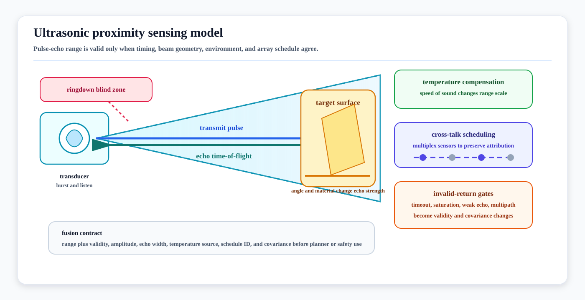

# Ultrasonic Proximity Sensing Models

<!-- kb-visual:start -->


*Visual: ultrasonic proximity sensing model showing transmit ringdown, acoustic beam cone, echo time-of-flight, temperature compensation, cross-talk scheduling, and invalid-return gates.*
<!-- kb-visual:end -->

Ultrasonic proximity sensors turn an emitted acoustic pulse into a close-range
distance, confidence, and validity claim. The useful autonomy model is not
"ultrasonic sees nearby objects"; it is "a range is accepted only when the
round-trip echo timing, beam geometry, environmental compensation, and
cross-talk schedule make the measurement valid for this maneuver."

---

## Related docs

- [Sensor Likelihoods, Noise, and Error Budgets](sensor-likelihoods-noise-error-budgets.md)
- [Sampling, FFT, Windowing, and Filtering](../signal-processing/sampling-fft-windowing-filtering.md)
- [Time Sync, PTP, Timestamping, and Latency Models](../systems-engineering/time-sync-ptp-timestamping-latency-models.md)
- [LiDAR Working Principles and Noise Models](../geometry-3d/lidar-working-principles-noise-models.md)
- [Close-Range Proximity and Safety Sensors](../../20-av-platform/sensors/close-range-proximity-safety-sensors.md)
- [Autonomous Docking and Precision Positioning](../../30-autonomy-stack/planning/autonomous-docking-precision-positioning.md)

---

## Why it matters for AV, perception, SLAM, and mapping

Ultrasonic range is valuable where optical or laser sensors have near-field
blind zones, where transparent or low-reflectivity objects matter, or where a
vehicle is docking at low speed near aircraft, pallets, racks, chargers,
doors, curbs, carts, or people. It is also easy to misuse: the sensor gives a
cone-limited acoustic return, not a semantic object, surface normal, full pose,
or safety rating by default.

For autonomy review, ultrasonic sensors mainly support:

- final-approach stopping and docking confirmation
- short-range blind-zone coverage around bumpers and underbody areas
- advisory obstacle evidence for low-speed planners
- sanity checks on LiDAR/camera near-field confidence
- safety-rated protective fields only when the product, integration, and
  validation evidence are certified for that role

The release question is whether the stack can explain why a specific range was
accepted, rejected, or downgraded in the operating condition being tested.

---

## Measurement contract

Typical inputs:

- transmit trigger time and receive timestamp
- transducer pose and mounting bracket geometry
- transducer frequency, pulse count, blanking window, and gain schedule
- temperature estimate and assumed propagation medium
- synchronization or multiplex schedule for neighboring sensors
- threshold, envelope, amplitude, width, and timeout settings

Typical outputs:

- range along the acoustic beam axis
- validity flag and timeout/saturation status
- echo amplitude, envelope width, and echo count if available
- confidence or covariance for downstream fusion
- cross-talk, near-field blanking, or out-of-range flags

The downstream consumer should know whether the output is raw echo timing,
device-filtered range, a safety-channel state, or an application-level obstacle
decision.

---

## Time-of-flight model

For a monostatic pulse-echo sensor, distance is estimated from round-trip time:

```
d = 0.5 * c_air * (t_echo - t_tx - t_delay)
```

where `c_air` is the local speed of sound and `t_delay` covers fixed
electronics, transducer, and firmware delays. TI's ultrasonic sensing guide
describes the same pulse-echo idea and notes that dry air at 20 deg C has a
sound speed of about 343 m/s.

A common dry-air approximation is:

```
c_air ~= 331.3 + 0.606 * T_C   meters/second
```

This is only a first-order compensation. Humidity, wind, turbulence, pressure
change, hot exhaust, rain, snow, mud, and transducer contamination can still
change range, amplitude, dropout, and false-positive behavior. Treat the
temperature term as a required correction, not a complete environmental model.

---

## Beam geometry, dead zones, and target reflectivity

An ultrasonic transducer emits a finite acoustic beam. The range is usually the
first accepted echo inside that beam, so the sensor cannot by itself report
where across the cone the object lies.

Key geometry effects:

- The cone gets wider with distance, so lateral uncertainty grows even when
  range uncertainty is small.
- Soft, angled, porous, cloth-like, or foam targets can absorb or redirect the
  echo.
- Specular surfaces can return a strong echo to the wrong receiver or no echo
  to the transmitter.
- Floor, wall, bumper, pallet-pocket, and aircraft-skin echoes can overlap in
  tight approach zones.
- Monostatic sensors have a blind zone caused by transmit ringdown and decay;
  TI describes frequency, pulse count, current limit, damping, and bistatic
  layouts as levers that affect minimum range.

For fusion, model ultrasonic as a range constraint with a beam-shaped
visibility region and explicit invalid-return gates. Do not turn a single cone
return into a precise 3D obstacle centroid.

---

## Echo confidence and multi-echo behavior

Echo processing usually filters, amplifies, rectifies, and thresholds the
received waveform or envelope before extracting time-of-flight. Some devices
or evaluation boards expose echo width, amplitude, and envelope diagnostics;
TI's PGA460 material describes time-varying gain, envelope extraction, echo
width, amplitude, and time-of-flight data as useful signal products.

Useful confidence features include:

- amplitude relative to noise floor
- envelope width and ringing shape
- first-arrival time versus strongest-peak time
- number of detected echo lobes
- frequency check against the transducer center frequency
- consistency across repeated pulses and adjacent sensors

Overlapping echoes are not rare in close spaces. The Sarabia et al. airborne
ultrasonic ToF paper shows why threshold or peak methods can miss hidden
overlapping echoes, while newer automotive work uses multipath-aware
Delay-Doppler processing for near-range parking environments. These methods do
not make ultrasonic globally robust; they show that echo interpretation is a
signal-processing problem, not just a GPIO-style proximity switch.

---

## Cross-talk and scheduling

Multiple ultrasonic sensors on the same vehicle, adjacent vehicles, or nearby
infrastructure can hear each other's pulses. The system needs a timing policy:

- Common mode fires sensors together when object-to-sensor attribution is not
  required and response time matters.
- Multiplex mode fires sensors in sequence to reduce cross-talk and identify
  which sensor produced the accepted range.
- External trigger mode lets a vehicle controller align acoustic pulses with
  state-estimator timestamps, planner phases, or safety-channel scans.
- Fleet or aisle deployments should consider acoustic interference between
  vehicles, not only sensors on one bumper.

Pepperl+Fuchs documents synchronization inputs, common mode, and multiplex mode
as ways to reduce minimum spacing and avoid switching faults. The tradeoff is
latency: sequential firing improves attribution but slows the full-array update
rate.

---

## Safety-rated versus advisory use

An ultrasonic measurement is not safety-rated because it uses ultrasound. The
safety role depends on the complete product, diagnostics, integration,
parameterization, proof testing, outputs, and standards evidence.

Separate these channels:

| Use | Contract |
|---|---|
| Safety-rated protective function | Use only certified safety-related sensor systems, safety outputs, diagnostics, validated field geometry, and the applicable machine-safety evidence. |
| Advisory obstacle evidence | Feed range and validity into perception, planning, or docking, but do not let it replace the certified stop path. |
| Calibration or diagnostics | Use echo residuals, timeout rates, and amplitude trends to monitor mounting, contamination, or environmental drift. |

IEC TS 62998-1 covers safety-related sensors used for protection of persons.
ISO 3691-4 covers safety requirements and verification for driverless
industrial trucks and their systems. Product pages such as Pepperl+Fuchs
USi-safety illustrate what an integrated safety ultrasonic system looks like:
evaluation unit, transducers, diagnostics, safe outputs, and temperature
compensation, not just a bare range sensor.

---

## Domain fit

| Domain | Fit | Notes |
|---|---|---|
| Road AV | Narrow but useful | Parking, low-speed maneuvering, trailer approach, curb/garage edges, and close obstacle checks. Poor fit for high-speed perception or long-range planning. |
| Airside | Strong for final clearance | Useful near aircraft, GSE, belt loaders, dollies, doors, and docking corridors. Must handle rain, washdown, wind, jet/exhaust turbulence, reflective aircraft surfaces, and strict safety separation. |
| Warehouse and yard | Strong | Pallet pockets, racks, glass, shrink-wrap, dock plates, AMR blind zones, and mixed indoor/outdoor loading areas. Cross-talk scheduling matters in dense fleets. |
| Port, mining, construction, agriculture | Situational | Useful for low-speed close clearances, but dust, mud, debris, wind, machinery noise, and contamination can dominate. Radar, LiDAR, bumpers, and cameras usually carry the broader scene context. |
| Delivery robot and campus | Situational | Helps around curbs, doors, glass, and short-range blind spots, but weather and vandalism/contamination require health monitoring and fallback behavior. |

---

## Failure modes and diagnostics

| Failure mode | Symptom | Diagnostic |
|---|---|---|
| Ringdown blind zone | Very close object not detected or reported late. | Verify minimum-range tests by pulse count, frequency, damping, and mounting. |
| Cross-talk | Ghost range appears when neighboring sensor fires. | Replay with trigger schedule, sensor ID, and array timing logs. |
| Angled or soft target miss | Object exists but echo is weak or absent. | Test by material, incidence angle, and surface texture. |
| Multipath or wall/floor echo | Stable false range near concave geometry. | Compare first arrival, strongest peak, adjacent sensors, and scene geometry. |
| Temperature gradient | Range bias changes with outdoor heat, freezer zones, exhaust, or sun load. | Plot residual versus local temperature and temperature-sensor placement. |
| Rain, snow, dust, mud, or ice | Dropout, reduced range, or noisy near-field returns. | Track amplitude, timeout, contamination state, and cleaning events. |
| Safety-role confusion | Planner treats advisory range as certified stop evidence. | Audit signal path from sensor output to safety controller and safety case. |
| Overconfident covariance | Fusion accepts bad range and rejects better modalities. | Run residual and NIS-style checks by distance, target class, weather, and speed. |

---

## Implementation checklist

- Mount sensors so the beam covers the hazard volume without pointing at the
  floor, bumper lip, mud flap, bracket, or known specular reflector.
- Calibrate transducer pose, minimum range, field shape, and blanking window
  with physical targets, not only nominal datasheet range.
- Log raw or intermediate echo diagnostics whenever hardware exposes them:
  amplitude, envelope width, echo count, timeout, saturation, and gain state.
- Store temperature source, compensation mode, and sensor firmware parameters
  with the recorded measurement.
- Synchronize or multiplex arrays explicitly; document the latency and
  attribution tradeoff.
- Keep `sensor_msgs/Range` style outputs paired with validity and covariance
  metadata before fusion.
- Validate by distance, angle, target material, weather, cleaning state,
  vehicle speed, neighboring-sensor activity, and site layout.
- For safety use, prove the complete safety function, not only the measurement
  physics.

---

## Sources

- Texas Instruments, [Ultrasonic Sensing Basics](https://www.ti.com/document-viewer/lit/html/slaa907)
- Texas Instruments, [PGA460 ultrasonic signal processor and transducer driver](https://www.ti.com/product/PGA460)
- Texas Instruments, [Ultrasonic Sensing in Automated Terrain-Type and Obstacle Detection in Robotic](https://www.ti.com/document-viewer/lit/html/slaa910)
- Pepperl+Fuchs, [Ultrasonic Sensor FAQ: External Influences on Sensor Operation](https://blog.pepperl-fuchs.com/en/2018/ultrasonic-sensor-faq-external-influences-on-sensor-operation/)
- Pepperl+Fuchs, [Ultrasonic Sensor FAQ: Synchronization and Common Mode](https://blog.pepperl-fuchs.com/en/2019/ultrasonic-sensor-faq-synchronization-and-common-mode/)
- Pepperl+Fuchs, [USi-safety ultrasonic sensor system](https://www.pepperl-fuchs.com/no-no/landingpage/industrial-sensors/usi-safety-gp28442)
- Pepperl+Fuchs, [USi-industry ultrasonic sensor system](https://www.pepperl-fuchs.com/en/landingpage/industrial-sensors/usi-industry-gp32335)
- IEC, [IEC TS 62998-1:2019 Safety-related sensors used for protection of persons](https://webstore.iec.ch/en/publication/31009)
- ISO, [ISO 3691-4:2023 Driverless industrial trucks and their systems](https://www.iso.org/standard/83545.html)
- Sarabia et al., "Accurate Estimation of Airborne Ultrasonic Time-of-Flight for Overlapping Echoes." Sensors, 2013. https://www.mdpi.com/1424-8220/13/11/15465
- Elamir et al., "A deep learning approach for direction of arrival estimation using automotive-grade ultrasonic sensors." arXiv, 2022. https://arxiv.org/abs/2202.12684
- Yi, Jeong, and Kim, "Multipath-robust joint ToF and velocity estimation for automotive ultrasonic sensors using Delay-Doppler processing." ICT Express, 2026. https://www.sciencedirect.com/science/article/pii/S240595952600007X
