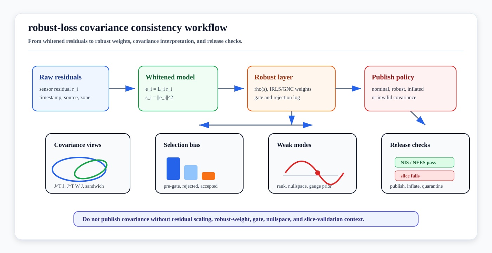

# Robust-Loss Covariance Consistency

<!-- kb-visual:start -->


*Visual: robust state-estimation covariance workflow showing residual whitening, robust weights, gate logs, covariance interpretations, and NIS/NEES release checks.*
<!-- kb-visual:end -->

## Related Docs

- [Robust Losses and M-Estimators](../probability-statistics/robust-losses-m-estimators-huber-cauchy-tukey-geman-mcclure.md)
- [Gaussian Noise, Covariance, Information, Whitening, and Uncertainty Ellipses](../probability-statistics/gaussian-noise-covariance-information.md)
- [Mahalanobis and Chi-Square Gating](../probability-statistics/mahalanobis-chi-square-gating.md)
- [Square-Root Information and Covariance Recovery](../numerical-linear-algebra/square-root-information-and-covariance-recovery.md)
- [Eigenvalues, Hessian Conditioning, and Observability](../numerical-linear-algebra/eigenvalues-hessian-conditioning-observability.md)
- [Nonlinear Least Squares from First Principles](../optimization/nonlinear-least-squares-first-principles.md)
- [Factor Graph Solver Patterns: Ceres, GTSAM, and g2o](../optimization/factor-graph-solver-patterns-ceres-gtsam-g2o.md)
- [GTSAM Factor Graph Optimization](gtsam-factor-graphs.md)
- [SLAM/VIO Observability, FEJ, Nullspace, and Consistency](slam-vio-observability-fej-nullspace-consistency.md)
- [Robust Pose Graph Optimization with GNC and riSAM](../../30-autonomy-stack/localization-mapping/slam-methods/robust-pgo-gnc-risam.md)
- [Uncertainty Calibration for Perception-SLAM Release Gates](../../60-safety-validation/verification-validation/uncertainty-calibration-perception-slam-release-gates.md)

## Why It Matters

Robust losses, gates, switchable constraints, and GNC schedules are useful damage-control tools. They keep bad measurements from dominating a SLAM, VIO, calibration, or tracking solve. The safety problem is that a clean robust objective does not automatically imply honest uncertainty.

A backend can publish a smooth pose, a low robustified cost, and a small covariance after many hard residuals were rejected or downweighted. That covariance may describe only the accepted, robustified, local linearized problem. It does not by itself describe the original measurement stream, the unknown outlier process, or the operational risk from a front end that is failing in a specific zone, sensor, weather condition, or map region.

The practical question is therefore:

```text
Given residuals, Jacobians, nominal measurement covariances, robust kernels,
gate decisions, and final robust weights, what covariance or protection output
is safe to expose to localization health, planners, map QA, and release gates?
```

## Inputs

- Raw residuals before rejection or gating.
- Whitened residuals after the stated measurement covariance or square-root information model.
- Residual Jacobians and active state variables at the final linearization point.
- Nominal measurement covariance or information matrix for every factor family.
- Robust loss type, scale, and solver convention.
- IRLS, GNC, dynamic covariance scaling, switchable-constraint, or other final factor weights.
- Gate decisions, rejected-factor logs, and low-weight-factor logs.
- Requested covariance block, marginal, or protection-level output.
- Frame, tangent-space convention, gauge prior, and marginal-vs-conditional interpretation.
- Ground-truth, survey, replay, or held-out reference data for NEES, NIS, or empirical coverage checks.

## Outputs

- MAP or filtered state estimate.
- Selected covariance, information block, marginal covariance, or protection bound.
- Label for the covariance interpretation: nominal Hessian, robustified local curvature, sandwich/asymptotic, empirical/replay, inflated, or invalid.
- Robust-weight telemetry by sensor, factor type, ODD slice, map zone, and time window.
- Pre-gate, rejected, downweighted, and post-gate residual statistics.
- NIS, NEES, ANEES, or empirical coverage report where reference data permits.
- Release or runtime action: publish covariance, publish degraded covariance, inflate, quarantine, controlled stop, or do not publish covariance.

## Core Conventions

Whitening comes before robust weighting:

```text
r_i = z_i - h_i(x)
e_i = L_i r_i
s_i = ||e_i||^2
cost_i = rho(s_i)
```

Here `L_i` is the inverse square root of the nominal measurement covariance. The robust scale should be interpreted in whitened units unless the implementation explicitly says otherwise.

For a local Gaussian least-squares model, the textbook covariance around the solved state is:

```text
P_nominal = (J^T S^-1 J)^-1
```

With robust weights, many backends effectively solve a local weighted problem:

```text
H_robust ~= sum_i J_i^T W_i J_i
P_robust_curvature ~= H_robust^-1
```

That covariance is conditional on the chosen robustification and the final weights. It is useful, but it is not the same object as the unconditional error distribution of a system that had to reject or suppress measurements.

For robust M-estimating equations, asymptotic covariance is often written in sandwich or Godambe form:

```text
V ~= A^-1 B A^-T / n

A = E[d psi_i / d theta]
B = E[psi_i psi_i^T]
```

This is a statistical variance estimate under assumptions about the residual process. In sliding-window SLAM, factors are correlated, graph structure changes over time, and finite-sample effects are large, so sandwich covariance should still be validated by replay, slices, or conservative inflation before it becomes a safety-facing number.

## Ceres and GTSAM Interpretation

Ceres documents covariance estimation as a local Jacobian-based procedure and explicitly requires residuals to be scaled so the covariance interpretation is meaningful. Its `Covariance::Options::apply_loss_function` default is `true`; setting it to `false` removes the loss function effect from covariance computation. A Ceres integration should therefore log whether a published covariance includes robust loss effects or is computed from the unrobustified model at the final solution.

GTSAM robust noise models combine a base noise model with an M-estimator, applying robust reweighting to whitened residuals. GTSAM `Marginals` then returns covariance or information for selected variables around the optimized graph. In a robust graph, treat the result as a local covariance for the robustified, linearized graph and verify behavior for the exact GTSAM version, factor types, and marginalization policy.

Neither library can infer a safety interpretation without the surrounding gate logs, robust-weight telemetry, gauge handling, and validation evidence.

## Consistency Failure Modes

| Failure | Cause | Diagnostic |
|---|---|---|
| Overconfident pose after outlier rejection | Covariance was computed only on accepted clean factors. | Compare pre-gate, rejected, downweighted, and post-gate residual distributions. |
| Low robust cost but bad localization | Front-end failures were repeatedly downweighted instead of fixed. | Track low-weight factors by sensor, route segment, weather, map zone, and class. |
| False release-gate pass | Selection bias hid hard slices from NIS/NEES or empirical coverage. | Evaluate accepted and rejected measurement sets separately. |
| Covariance collapses in a gauge direction | Prior, marginalization, or robust weights injected spurious information. | Check Hessian rank, weak eigenvectors, nullspace, gauge priors, and FEJ policy. |
| Planner trusts a degraded estimate | Runtime interface exposed covariance without robustification health flags. | Publish covariance with robust-weight mass, gate rate, and validity status. |
| GNC selects the wrong consensus | A self-consistent outlier cluster survived robust optimization. | Compare against absolute priors, map QA, loop quarantine, and replay evidence. |
| Sandwich covariance is treated as proof | Asymptotic formula was applied to correlated, finite, biased data. | Use held-out slices, block bootstrap, replay, or conservative inflation. |
| Marginal covariance is misread | Dense marginal, conditional block, tangent convention, or frame was undocumented. | Record requested block, variables marginalized, frame, tangent space, and gauge prior. |

## AV Relevance

For autonomous vehicles, robust-loss covariance is not just a backend detail. It controls localization integrity, map-publication gates, canary releases, planner clearance margins, controlled-stop triggers, incident triage, and whether a replay failure is blamed on the front end, backend, map, sensor, or validation protocol.

Use robust losses for damage control, but report robust evidence beside covariance:

- Robust-weight mass and low-weight-factor count.
- Accepted, rejected, and downweighted factor counts.
- NIS before and after gating.
- NEES where survey, motion-capture, or high-grade reference data exists.
- ODD slice results by road, apron, warehouse aisle, yard lane, mine road, farm row, weather, time of day, and sensor health.
- Runtime action when covariance is local-only, robustified, inflated, stale, or invalid.

## Domain Fit

| Domain | Fit |
|---|---|
| Outdoor road AV | High: GNSS multipath, map mismatches, loop closures, dynamic objects, and degraded lane geometry can all create downweighted evidence that must remain visible. |
| Airside | High: repeated stands, aircraft reflections, temporary GSE, wet apron multipath, and low-texture regions make post-gate covariance easy to overtrust. |
| Warehouse, yard, and port autonomy | High: repeated aisles, containers, forklifts, parked trailers, and GNSS-denied zones need robust weights tied to operational health. |
| Mining, construction, and agriculture | High: dust, mud, terrain changes, crop rows, and sparse landmarks make robust losses common and slice validation essential. |
| Delivery robots and campuses | Medium to high: small platforms face occlusion, sidewalk clutter, glass, GNSS shadows, and repeated visual structure. |
| Pure perception training | Supporting: use the robust-loss math, but confidence calibration for model outputs belongs in the calibration and uncertainty pages. |

## Implementation Checklist

- Store raw residual, whitened residual, robust loss type, robust scale, final weight, gate result, covariance source, factor family, timestamp, and route/map zone per factor.
- Keep pre-gate, rejected, downweighted, and accepted statistics separate in logs and release reports.
- Compute covariance only for decision-relevant blocks instead of treating full dense covariance as a free byproduct.
- Attach a method flag to every covariance: `nominal`, `robust-curvature`, `sandwich`, `empirical`, `inflated`, or `invalid`.
- For Ceres, document `apply_loss_function` for every covariance report.
- For GTSAM, document graph contents, robust noise models, linearization point, marginalization policy, and covariance query method.
- Treat redescending losses or very low robust-weight mass as a health alert, not a silent success.
- Check weak modes, gauge directions, marginalization priors, and tangent-space conventions before publishing pose covariance.
- Require slice-level NIS/NEES or empirical coverage before release; do not rely only on aggregate averages.
- Define planner behavior for invalid or degraded covariance before the system reaches runtime.

## Practical Review Questions

- Are robust thresholds expressed in whitened units?
- Are rejected factors still counted in validation and incident triage?
- Does NIS/NEES pass by ODD slice, not only in aggregate?
- Are low-weight zones, sensors, and factor families monitored over time?
- Does the planner know whether covariance is robustified, inflated, invalid, or local-only?
- Is the covariance block tied to a concrete runtime or release action?
- Would the same covariance be published if robust losses were disabled but gates were unchanged?
- Does the graph preserve physical nullspaces after robust weighting and marginalization?

## Sources

- Ceres Solver, "Covariance Estimation": https://ceres-solver.readthedocs.io/latest/nnls_covariance.html
- Ceres Solver, "LossFunction": https://ceres-solver.readthedocs.io/latest/nnls_modeling.html#lossfunction
- GTSAM Doxygen, `gtsam::noiseModel::Robust`: https://gtsam.org/doxygen/a04491.html
- GTSAM, "Look Ma, No RANSAC": https://gtsam.org/2019/09/20/robust-noise-model.html
- GTSAM Docs, "Marginals": https://borglab.github.io/gtsam/marginals/
- Huber, "Robust Estimation of a Location Parameter": https://projecteuclid.org/journals/annals-of-mathematical-statistics/volume-35/issue-1/Robust-Estimation-of-a-Location-Parameter/10.1214/aoms/1177703732.full
- White, "A Heteroskedasticity-Consistent Covariance Matrix Estimator and a Direct Test for Heteroskedasticity": https://www.econometricsociety.org/publications/econometrica/browse/1980/05/01/heteroskedasticity-consistent-covariance-matrix-estimator-and
- Khosoussi and Shames, "Joint State and Noise Covariance Estimation": https://arxiv.org/abs/2502.04584
- OpenVINS, "First-Estimate Jacobian Estimators": https://docs.openvins.com/fej.html
